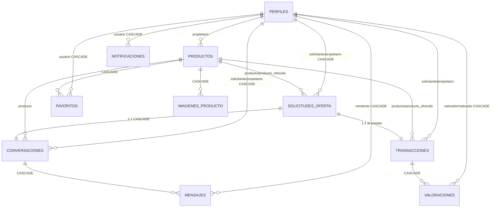

# 03 — Base de datos

> Anterior: [`02_arquitectura_y_carpetas.md`](./02_arquitectura_y_carpetas.md)  |  Siguiente: [`04_api_y_backend.md`](./04_api_y_backend.md)

---

## Principios de diseño

| Decisión | Qué significa |
|----------|--------------|
| **"Thick Database"** | La lógica crítica vive en PostgreSQL (RPCs, triggers, RLS), no en Flutter |
| **Estados en lugar de borrado** | Los registros rara vez se borran; cambian de estado |
| **Stock por raciones** | `raciones_disponibles` se decrementa al aceptar. Un plato puede servir a varios compradores |
| **Privacidad de ubicación por capas** | Coordenadas públicas (aproximadas) siempre visibles; exactas solo tras transacción aceptada |

---

## Diagrama ER

**Puntos clave del diagrama:**
- `perfiles` es el nodo central. Sus FKs son CASCADE en casi todo, excepto en `transacciones` (RESTRICT) y `productos.propietario_id` (RESTRICT).
- `solicitudes_oferta` → genera siempre 1 `conversacion` y, si se acepta, 1 `transaccion` (relaciones 1:1 con UNIQUE).
- `productos` aparece dos veces en solicitudes/transacciones: como solicitado y como `producto_ofrecido_id` en intercambios.

---

## Tablas

### `perfiles`
Extiende `auth.users`. Almacena datos públicos y preferencias.

| Columna | Tipo | Notas |
|---------|------|-------|
| `id` | UUID PK | Mismo UUID que `auth.users` |
| `nombre` | TEXT NOT NULL | |
| `email` | TEXT NOT NULL UNIQUE | |
| `url_avatar` | TEXT NOT NULL DEFAULT `''` | |
| `ciudad` | TEXT | |
| `bio` | TEXT | CHECK ≤ 280 chars |
| `preferencias` | TEXT[] | Etiquetas dietéticas personales |
| `alergenos` | TEXT[] | Alérgenos Anexo II del usuario |
| `preferencias_notificaciones` | JSONB | Default: `{"pedidos":true,"mensajes":true,"valoraciones":true}` |
| `certificacion_sanitaria` | TEXT | Texto libre sin validación (deuda técnica) |
| `es_moderador` | BOOLEAN DEFAULT false | |
| `valoracion_media` | NUMERIC(3,2) DEFAULT 0 | Recalculada por trigger |
| `numero_valoraciones` | INTEGER DEFAULT 0 | Recalculado por trigger |
| `latitud_predeterminada` | NUMERIC(9,6) | **Privada** |
| `longitud_predeterminada` | NUMERIC(9,6) | **Privada** |

**Columnas accesibles por SELECT directo (cualquier usuario autenticado):**
`id`, `nombre`, `url_avatar`, `valoracion_media`, `numero_valoraciones`, `ciudad`, `bio`, `alergenos`, `preferencias_notificaciones`, `creado_en`

**Solo accesibles via RPC `obtener_mi_perfil` (propio usuario):**
`email`, `preferencias`, `certificacion_sanitaria`, `es_moderador`, `latitud_predeterminada`, `longitud_predeterminada`, `actualizado_en`

---

### `productos`

| Columna | Tipo | Notas |
|---------|------|-------|
| `id` | UUID PK | |
| `propietario_id` | UUID NOT NULL | FK → `perfiles(id)` ON DELETE **RESTRICT** |
| `titulo` | TEXT NOT NULL | |
| `descripcion` | TEXT NOT NULL | |
| `tipo_oferta` | TEXT NOT NULL | CHECK: `venta` \| `intercambio` |
| `precio` | NUMERIC(10,2) | NOT NULL y ≥0 si es venta; NULL si es intercambio |
| `estado` | TEXT DEFAULT `disponible` | CHECK: `disponible`, `agotado`, `completado`, `cancelado`, `reservado`* |
| `categoria` | TEXT NOT NULL | CHECK: 13 valores (ver abajo) |
| `etiquetas` | TEXT[] | Etiquetas dietéticas del plato |
| `alergenos` | TEXT[] | Alérgenos Anexo II presentes |
| `sin_alergenos_declarados` | BOOLEAN DEFAULT false | Declaración explícita de ausencia |
| `raciones_totales` | INTEGER DEFAULT 1 | CHECK ≥ 1 |
| `raciones_disponibles` | INTEGER DEFAULT 1 | CHECK ≥ 0 y ≤ totales |
| `latitud_publica` / `longitud_publica` | NUMERIC(9,6) NOT NULL | Siempre visibles (aproximadas) |
| `latitud_exacta` / `longitud_exacta` | NUMERIC(9,6) | Solo via RPC tras transacción aceptada |

**13 categorías válidas:** `cuchara`, `arroces_pastas`, `carnes`, `pescados`, `verduras_ensaladas`, `tapas_aperitivos`, `pan_masas`, `postres_dulces`, `bebidas_licores`, `frescos_huerto`, `quesos_embutidos`, `despensa`, `otros`

**CHECKs importantes:**
- Debe haber alérgenos en `alergenos` **O** `sin_alergenos_declarados = true` (nunca ninguno de los dos).
- `reservado`* es estado vestigial, ninguna RPC lo usa.

---

### `imagenes_producto`
Máximo 5 fotos por producto. UNIQUE(`producto_id`, `posicion`) con posicion CHECK 0..4.
FK → `productos(id)` ON DELETE CASCADE.

---

### `favoritos`
PK compuesta (`usuario_id`, `producto_id`). No hay UPDATE — el toggle es DELETE + INSERT.
FK CASCADE desde `perfiles` y `productos`. Incluida en Realtime.

---

### `solicitudes_oferta`

| Columna clave | Notas |
|---------------|-------|
| `tipo_solicitud` | CHECK: `venta` \| `intercambio` |
| `estado` | CHECK: `pendiente`, `aceptada`, `denegada`, `auto_denegada`, `cancelada` |
| `cantidad` | Raciones solicitadas, CHECK ≥ 1 |
| `producto_ofrecido_id` + `cantidad_ofrecida` | Solo en intercambios (NOT NULL si `tipo=intercambio`, NULL si `tipo=venta`) |

CHECK: `solicitante_id <> propietario_id`
UNIQUE parcial: `(producto_id, solicitante_id) WHERE estado = 'pendiente'`

---

### `transacciones`
Se crea al aceptar una solicitud. UNIQUE sobre `solicitud_id`.

| Columna clave | Notas |
|---------------|-------|
| `estado` | DEFAULT `aceptada`. CHECK: `pendiente`*, `aceptada`, `completada`, `cancelada`, `reportada`* |
| `total` | NOT NULL en ventas (precio × cantidad); NULL en intercambios |
| `completado_en` | Se rellena al pasar a `completada` |

FK `solicitante_id` y `propietario_id` → `perfiles(id)` ON DELETE **RESTRICT** (a diferencia del resto de tablas).

> *`pendiente` y `reportada` son estados fantasma — existen en el CHECK pero ningún flujo los asigna.

---

### `conversaciones`
Sala de chat ligada a una solicitud. Se crea junto con la solicitud (atómico en la RPC).
`ultimo_mensaje_en` se actualiza por trigger al recibir mensajes.

---

### `mensajes`

| Columna | Notas |
|---------|-------|
| `contenido` | CHECK: `length(trim(contenido)) > 0` |
| `leido_en` | Solo actualizable por el participante que no es el remitente. GRANT columnar restringe el UPDATE exclusivamente a esta columna. |

---

### `valoraciones`
UNIQUE(`transaccion_id`, `valorador_id`). CHECK `puntuacion BETWEEN 1 AND 5`. CHECK `valorador_id <> valorado_id`.
Un trigger recalcula `valoracion_media` y `numero_valoraciones` en `perfiles` tras cada INSERT.

---

### `reportes`
Polimórfico: `tipo_objetivo` ∈ `{producto, perfil, mensaje}` y `objetivo_id` sin FK (única excepción de integridad referencial en el esquema).

---

### `notificaciones`
Las RPCs insertan filas aquí con payload JSONB normalizado: `solicitud_id`, `producto_id`, `conversacion_id`, `transaccion_id`.
Índice parcial: `(usuario_id, creado_en DESC) WHERE leido_en IS NULL`.
