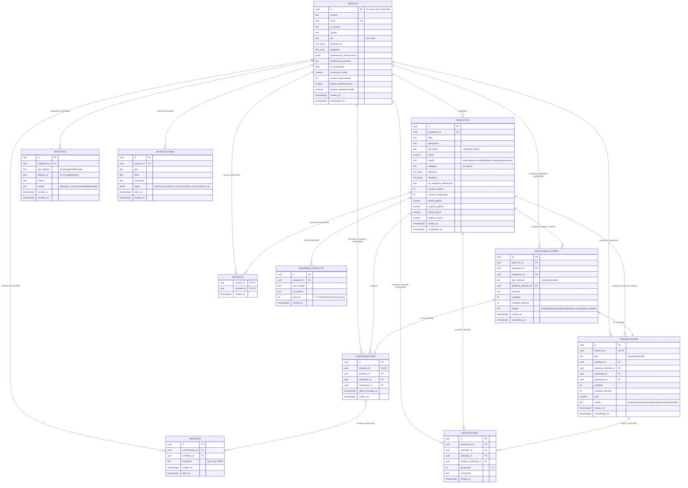
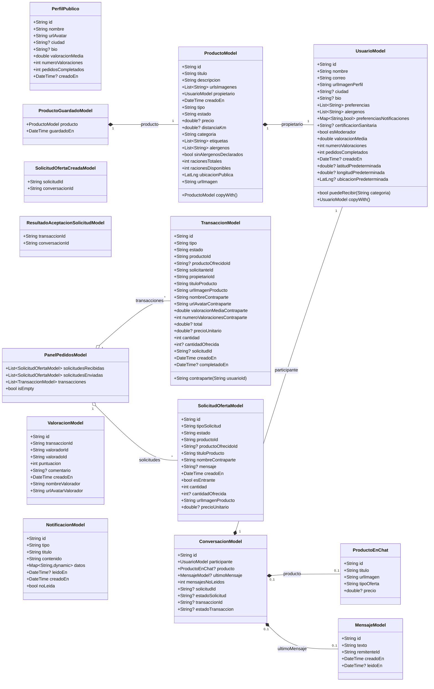

# Documentación Técnica — YumYum

## 1. Visión general
YumYum es una aplicación móvil y web diseñada para facilitar la venta e intercambio local de comida casera. Actúa como un mercado de proximidad donde los usuarios pueden publicar sus elaboraciones ("ofertas" que pueden ser para venta o intercambio), filtrarlas por proximidad, categoría, etiquetas dietéticas y alérgenos, y negociar directamente a través de un chat en tiempo real integrado. El valor principal de la aplicación reside en conectar vecinos para reducir el desperdicio de comida, fomentar la economía local y facilitar transacciones basadas en la cercanía geográfica, garantizando la privacidad de las ubicaciones exactas hasta que se cierra un acuerdo mutuo.

## 2. Stack tecnológico
El proyecto sigue una arquitectura moderna centrada en el desarrollo multiplataforma y un backend Serverless/BaaS (Backend as a Service):

*   **Frontend (Flutter, SDK >=3.3.0 <4.0.0):**
    *   **Flutter + flutter_web_plugins:** Framework elegido por su capacidad de compilar para iOS, Android y Web desde una única base de código.
    *   **flutter_riverpod ^3.3.1:** Gestor de estado reactivo. Permite inyección de dependencias segura, manejo simplificado del estado asíncrono y un bajo acoplamiento.
    *   **go_router ^14:** Sistema de enrutamiento declarativo para gestionar la navegación compleja (`ShellRoute` con `BottomNavigationBar`) y las redirecciones de autenticación de forma reactiva.
    *   **flutter_map ^6 + latlong2 ^0.9:** Librerías para renderizar los mapas interactivos con un enfoque *open-source* (sin dependencia estricta de SDKs comerciales).
    *   **supabase_flutter ^2.12:** Cliente oficial: auth, REST, Realtime y Storage en una sola dependencia.
    *   **geolocator ^12:** Obtención de coordenadas del dispositivo y permisos de ubicación.
    *   **image_picker ^1.1:** Selección de imágenes desde galería/cámara para avatares e imágenes de producto.
    *   **cached_network_image ^3.3:** Caché de imágenes remotas para feeds y carruseles.
    *   **google_fonts ^6.2:** Tipografías Inter (sans) y Fraunces (display) usadas por el tema visual.
    *   **shared_preferences ^2.3:** Persistencia local del tema activo y otras preferencias ligeras.
    *   **uuid ^4.3:** Generación de identificadores locales (e.g., nombres de blob en Storage).
    *   **intl ^0.19:** Formateo de fechas, distancias y monedas con locale `es`.
    *   **web ^1.0:** Acceso al DOM en web para sincronizar el `meta theme-color` de la PWA con el tema activo (uso aislado con conditional imports).
    *   **http ^1.2:** Cliente HTTP del asistente IA. Apunta a un backend Node externo (no incluido en este repositorio).
*   **Backend & Base de Datos:**
    *   **Supabase (PostgreSQL):** Elegido como BaaS. Provee base de datos relacional potente, autenticación delegada, control de acceso a nivel de fila (RLS), almacenamiento de archivos (Storage) y notificaciones en tiempo real vía WebSockets (Realtime).
*   **Infraestructura:**
    *   El frontend web está preparado para despliegue como sitio estático en **Render** mediante scripts de CI automatizados.
    *   La autenticación usa **PKCE** (`AuthFlowType.pkce`) y desactiva `detectSessionInUri` para gestionar manualmente los enlaces de recovery desde el router.

## 3. Arquitectura general
La arquitectura global sigue el paradigma **Feature-First** (por funcionalidades) en el frontend y un enfoque **"Thick Database"** en el backend.

**Capas del Frontend (`lib/`):**
*   **Core (`lib/core/`):** Utilidades transversales, configuración de Supabase, enrutador, manejo de errores, proveedores de ubicación, tema visual y servicios compartidos (asistente IA).
*   **Features (`lib/features/`):** Módulos aislados (auth, producto, solicitudes, mapa, etc.). Dentro de cada módulo se sigue una variación de Clean Architecture adaptada a Riverpod:
    *   *Domain:* Modelos y entidades puras de Dart (`ProductoModel`, `UsuarioModel`).
    *   *Data:* Repositorios (y opcionalmente DTOs) que encapsulan las llamadas a Supabase.
    *   *Controllers/Providers:* Notificadores de Riverpod que contienen la lógica de negocio y manejan el estado (e.g. `PublicarProductoController`).
    *   *Screens/Widgets:* La capa de interfaz de usuario puramente declarativa y reactiva a los Providers.

**Capas del Backend (Supabase):**
*   **Autenticación:** Gestionada por el módulo GoTrue de Supabase con flujo PKCE.
*   **Capa de Acceso y Reglas (RLS):** Las consultas pasan primero por las políticas de PostgreSQL, asegurando que un usuario solo lee/escribe lo que le corresponde. Se complementan con `GRANT`s columnares para restringir las columnas modificables incluso cuando la fila esté permitida.
*   **Lógica Transaccional:** Se apoya fuertemente en Procedimientos Almacenados (RPCs) de PL/pgSQL para garantizar atomicidad y evitar inconsistencias sin tener que montar una API Node/Python intermedia.

### 3.1. Estructura del proyecto para nuevos desarrolladores

Este apartado sirve como mapa de entrada para una persona junior que se incorpora al proyecto. La idea principal es que YumYum no está organizado por tipo técnico global (`pantallas/`, `modelos/`, `servicios/`), sino por **funcionalidades de negocio**. Por eso, cuando quieras tocar algo relacionado con productos, normalmente trabajarás dentro de `lib/features/producto/`; si quieres tocar chats, irás a `lib/features/chat/`; y si algo afecta a toda la app, probablemente estará en `lib/core/`.

#### 3.1.1. Vista general de carpetas

```text
YumYum/
|-- assets/                         # Recursos empaquetados con Flutter
|   `-- images/                     # Logos, iconos e imágenes locales
|
|-- doc/                            # Documentación auxiliar
|-- documentacion/                  # Documentación principal del proyecto
|   |-- documentacion_tecnica.md
|   |-- estado_tecnico_actual.md
|   |-- roadmap_tecnico_yumyum.md
|   `-- roadmap_tfg_acotado.md
|
|-- lib/                            # Código fuente de la aplicación Flutter
|   |-- main.dart                   # Punto de entrada de la app
|   |
|   |-- core/                       # Código compartido entre features
|   |   |-- constants/              # Rutas, estados, nombres de Supabase, assets,
|   |   |                           # categorías de producto, alérgenos UE,
|   |   |                           # etiquetas dietéticas, ubicaciones por defecto
|   |   |-- errors/                 # Excepciones y traducción de errores
|   |   |-- feedback/               # Helpers para mostrar feedback en UI
|   |   |-- format/                 # Formateadores compartidos (tiempo relativo, etc.)
|   |   |-- location/               # Servicios/providers de ubicación
|   |   |-- preferencias/           # Inyección de SharedPreferences
|   |   |-- providers_refresher.dart # Helpers para invalidar grupos de providers
|   |   |-- router/                 # GoRouter y reglas de redirección
|   |   |-- services/               # Servicios transversales (asistente IA)
|   |   |-- supabase/               # Configuración e inyección del cliente Supabase
|   |   |-- theme/                  # Tema, colores, persistencia y sync con la PWA
|   |   `-- widgets/                # Widgets reutilizables globales
|   |       |-- ui/                 # Componentes UI comunes de YumYum
|   |       |   |-- yum_app_bar.dart
|   |       |   |-- yum_background.dart
|   |       |   |-- yum_bottom_nav.dart
|   |       |   |-- yum_button.dart
|   |       |   |-- yum_card.dart
|   |       |   |-- dish_card_item.dart
|   |       |   |-- label_seccion.dart
|   |       |   `-- boton_ia_global.dart
|   |       |-- yumyum_app_bar.dart # AppBar global con badge de notificaciones
|   |       |-- avatar_usuario.dart
|   |       `-- selector_ubicacion_mapa.dart
|   |
|   `-- features/                   # Módulos organizados por funcionalidad
|       |-- ajustes/                # Hub de gestión de cuenta y preferencias
|       |   |-- screens/            # Ajustes y preferencias de notificaciones
|       |   `-- widgets/            # Tile, grupo y selector de tema
|       |
|       |-- auth/                   # Login, registro y recuperación de contraseña
|       |   |-- controllers/
|       |   |-- data/{dtos,repositories}/
|       |   |-- domain/{entities,repositories}/
|       |   |-- providers/
|       |   |-- screens/            # Iniciar sesión, registro, recuperar,
|       |   |                       # restablecer (token PKCE) y respuesta OAuth
|       |   `-- widgets/
|       |
|       |-- chat/                   # Conversaciones y mensajes realtime
|       |   |-- controllers/        # Envío, lectura y estado de conversación
|       |   |-- data/{dtos,repositories}/
|       |   |-- domain/{entities,repositories}/
|       |   |-- providers/
|       |   `-- screens/            # Lista de chats y pantalla de conversación
|       |
|       |-- favoritos/              # Productos guardados por el usuario
|       |   |-- controllers/        # Toggle anadir/quitar favorito
|       |   |-- data/repositories/  # Stream realtime y consulta agregada
|       |   |-- domain/{entities,repositories}/
|       |   |-- providers/          # Set de ids favoritos y listado guardado
|       |   |-- screens/            # Pantalla "Guardados"
|       |   `-- widgets/            # Tarjeta de plato guardado
|       |
|       |-- inicio/                 # Feed principal con filtros avanzados
|       |   |-- providers/          # Filtros: búsqueda, categoría, etiquetas,
|       |   |                       # alérgenos excluidos, tipo, orden
|       |   |-- screens/            # Pantalla inicial con productos cercanos
|       |   `-- widgets/            # Buscador, chips, bottom sheet de filtros,
|       |                           # hero del feed y cabecera contextual
|       |
|       |-- mapa/                   # Vista de mapa con filtros propios
|       |   |-- providers/
|       |   `-- screens/            # Pantalla de productos geolocalizados
|       |
|       |-- notificaciones/         # Centro de notificaciones realtime
|       |   |-- data/{dtos,repositories}/
|       |   |-- domain/{entities,repositories}/
|       |   |-- providers/
|       |   `-- screens/
|       |
|       |-- pedidos/                # Solicitudes y transacciones unificadas
|       |   |-- controllers/
|       |   |-- data/{dtos,repositories}/
|       |   |-- domain/{entities,repositories}/
|       |   |-- providers/          # Panel unificado y detalle
|       |   |-- screens/
|       |   `-- widgets/
|       |
|       |-- perfil/                 # Perfil propio, edición y perfil público
|       |   |-- controllers/
|       |   |-- data/{dtos,repositories}/
|       |   |-- domain/entities/
|       |   |-- providers/
|       |   |-- screens/            # Perfil, edición, ubicación predeterminada
|       |   |                       # y perfil público de otro usuario
|       |   `-- widgets/
|       |
|       |-- principal/              # Shell principal con navegación inferior
|       |   `-- screens/
|       |
|       |-- producto/               # Catálogo, publicación, edición y detalle
|       |   |-- controllers/        # Publicar/editar, contacto y formularios
|       |   |-- data/{dtos,repositories}/
|       |   |-- domain/{entities,repositories}/
|       |   |-- providers/          # Catálogo, búsqueda, detalle, ubicación exacta
|       |   |-- screens/
|       |   `-- widgets/
|       |
|       |-- reportes/               # Reportes/moderación
|       |   |-- data/repositories/
|       |   |-- domain/repositories/
|       |   `-- providers/
|       |
|       |-- solicitudes/            # Solicitudes de compra/intercambio
|       |   |-- controllers/
|       |   |-- data/{dtos,repositories}/
|       |   |-- domain/{entities,repositories}/
|       |   `-- providers/
|       |
|       `-- valoraciones/           # Valoraciones tras transacciones
|           |-- controllers/
|           |-- data/{dtos,repositories}/
|           |-- domain/{entities,repositories}/
|           |-- providers/
|           `-- screens/
|
|-- scripts/                        # Scripts de desarrollo y build
|   |-- build
|   |-- build_web_from_env.sh
|   |-- run_dev.ps1
|   `-- run_local.sh
|
|-- supabase/                       # Backend Supabase versionado
|   |-- config.toml                 # Configuración local de Supabase
|   `-- migrations/                 # Evolución del esquema, RLS, triggers y RPCs
|
|-- test/                           # Pruebas automatizadas
|   |-- core/                       # Tests de piezas compartidas
|   |-- features/                   # Tests por feature
|   |-- helpers/                    # Utilidades para tests
|   `-- supabase/                   # Tests sobre migraciones/reglas SQL
|
|-- web/                            # Archivos específicos del build web
|   |-- icons/
|   |-- favicon.png
|   |-- index.html
|   `-- manifest.json
|
|-- pubspec.yaml                    # Dependencias, SDK, assets y metadatos Flutter
|-- pubspec.lock                    # Versiones exactas resueltas
|-- analysis_options.yaml           # Reglas de lint/análisis estático
|-- .env.example                    # Plantilla de variables de entorno
`-- README.md                       # Resumen inicial del proyecto
```

**Carpetas y archivos de primer nivel:**
*   **`lib/`:** Código fuente principal de Flutter. Aquí vive la aplicación real: arranque, rutas, estado, pantallas, widgets, repositorios y modelos.
*   **`test/`:** Pruebas automatizadas. Replica parcialmente la estructura de `lib/` y también incluye tests de migraciones SQL de Supabase.
*   **`supabase/`:** Configuración local de Supabase y migraciones SQL. Es la fuente de verdad del esquema de base de datos, políticas RLS, triggers y RPCs.
*   **`assets/images/`:** Imágenes empaquetadas con la app, como logos e iconos. Están declaradas en `pubspec.yaml`.
*   **`web/`:** Archivos propios del build web de Flutter: `index.html`, manifest e iconos PWA.
*   **`scripts/`:** Scripts de apoyo para desarrollo local y build, por ejemplo ejecución local o construcción web usando variables de entorno.
*   **`documentacion/`:** Documentación funcional, técnica y roadmap del proyecto.
*   **`doc/`:** Carpeta auxiliar de documentación o recursos adicionales del proyecto.
*   **`pubspec.yaml`:** Define nombre del proyecto, versión, SDK de Dart, dependencias, dependencias de desarrollo y assets.
*   **`pubspec.lock`:** Bloquea versiones exactas de dependencias. No se edita a mano; se actualiza con `flutter pub get`.
*   **`analysis_options.yaml`:** Reglas de análisis estático y linting de Dart/Flutter.
*   **`.env.example`:** Plantilla de variables necesarias. El archivo `.env` real no debe tratarse como documentación pública ni compartirse con secretos.
*   **`.dart_tool/`, `build/` y logs `flutter_*.log`:** Archivos generados por herramientas. Sirven para la máquina local, no para entender la arquitectura.

#### 3.1.2. Punto de entrada de la aplicación

El archivo `lib/main.dart` es el primer sitio que conviene leer. Hace siete cosas importantes:

1.  Inicializa Flutter con `WidgetsFlutterBinding.ensureInitialized()`.
2.  Activa URLs limpias en web mediante `usePathUrlStrategy()`.
3.  Fija la locale por defecto en `'es'` y precarga los símbolos de fecha para `DateFormat(..., 'es')`.
4.  Comprueba que existan `SUPABASE_URL` y `SUPABASE_ANON_KEY` usando `SupabaseConfig`. Si faltan, arranca una app de respaldo informativa.
5.  Inicializa Supabase con `AuthFlowType.pkce` y `detectSessionInUri: false` (el router gestiona las URLs de recovery manualmente).
6.  Carga `SharedPreferences` antes de `runApp` para que el `temaProvider` se construya de forma síncrona y la app arranque ya con el tema elegido sin "flash" de tema por defecto.
7.  Arranca dentro de un `ProviderScope` con `retry: (count, error) => null` (sin reintentos automáticos) y un override que inyecta `SharedPreferences` ya inicializado.

Desde ahí se renderiza `YumYumApp`, que construye un `MaterialApp.router` consumiendo `appRouterProvider` y `temaProvider`. Esto permite que tanto la navegación como la paleta visual reaccionen al estado.

#### 3.1.3. `lib/core/`: código compartido por toda la app

`core` contiene piezas transversales. Si una clase, constante o widget se usa en varias funcionalidades y no pertenece claramente a una feature concreta, debería vivir aquí.

*   **`core/constants/`:** Constantes globales. Incluye rutas (`rutas_app.dart`), nombres de tablas/RPCs/buckets de Supabase (`supabase_names.dart`), estados de negocio (`estados_app.dart`), categorías de producto (`categorias_producto.dart`), etiquetas dietéticas (`etiquetas_dieteticas.dart`), alérgenos del Anexo II (`alergenos_ue.dart`), assets (`app_assets.dart`) y ubicaciones por defecto (`ubicaciones_app.dart`).
*   **`core/router/`:** Configuración de GoRouter. `app_router.dart` define rutas públicas, rutas privadas, `ShellRoute` con navegación principal y redirecciones según autenticación.
*   **`core/supabase/`:** Configuración e inyección del cliente Supabase. `supabase_config.dart` lee variables de compilación y `supabase_client_provider.dart` expone el cliente al resto de providers.
*   **`core/theme/`:** Tema visual de la app. Incluye `app_theme.dart` (Material3 + tipografías Inter/Fraunces), `yum_colors.dart` con los dos temas (`huertoModerno` por defecto y `mesaBarrio`), `tema_provider.dart` (persistencia en SharedPreferences) y `theme_color_web.dart`/`theme_color_web_real.dart`/`theme_color_web_stub.dart` (conditional imports para sincronizar el `meta theme-color` de la PWA con el tema activo).
*   **`core/preferencias/`:** Inyección de `SharedPreferences` mediante `preferenciasLocalesProvider`, sobrescrito en `main.dart`.
*   **`core/widgets/`:** Widgets reutilizables no ligados a una sola feature, como `YumAppBar`, `YumBackground`, `YumButton`, `YumCard`, `YumBottomNav`, `DishCardItem`, `LabelSeccion`, `AvatarUsuario`, `SelectorUbicacionMapa`, `YumYumAppBar` (AppBar con badge dinámico de notificaciones) y `BotonIAGlobal` (FAB del asistente IA).
*   **`core/services/`:** Servicios transversales no ligados a ninguna feature concreta. Actualmente solo `IAService`, cliente HTTP del asistente IA contra un backend Node externo (`localhost:3000` por defecto, `10.0.2.2` en emuladores Android).
*   **`core/location/`:** Servicios y providers de ubicación. Encapsulan permisos, coordenadas actuales, formato de distancia e integración con `geolocator`.
*   **`core/errors/`:** Excepciones de aplicación y traducción de errores técnicos a mensajes entendibles para el usuario.
*   **`core/feedback/`:** Utilidades para mostrar feedback en UI (snackbars de éxito/error, normalizados).
*   **`core/format/`:** Formateadores compartidos como `tiempo_relativo.dart` (e.g., "hace 5 min").
*   **`core/providers_refresher.dart`:** Extensiones y utilidades para invalidar providers relacionados cuando una acción cambia datos compartidos, como publicar un producto o modificar el catálogo.

Regla práctica: si estás trabajando en una pantalla y te apetece crear algo en `core`, pregúntate si lo van a reutilizar al menos dos features. Si la respuesta es no, probablemente debería quedarse dentro de la feature.

#### 3.1.4. `lib/features/`: módulos de negocio

Cada carpeta dentro de `features` representa una parte reconocible del producto:

*   **`auth/`:** Inicio de sesión, registro, recuperación y restablecimiento de contraseña. También contiene el estado principal de autenticación y el modelo `UsuarioModel` que viaja por toda la app.
*   **`principal/`:** Shell tras iniciar sesión: contenedor de navegación inferior y enrutado dentro del área privada.
*   **`inicio/`:** Feed con productos cercanos, buscador, chips de categoría, bottom sheet de filtros (etiquetas dietéticas, alérgenos a excluir, tipo, orden) y FAB del asistente IA.
*   **`mapa/`:** Visualización geográfica de productos con sus propios filtros (distancia por zona visible / radio / todas, además de los filtros comunes).
*   **`producto/`:** Publicación, edición, eliminación, detalle, tarjetas, búsqueda, carrusel de imágenes y selectores de radio y ubicación.
*   **`favoritos/`:** Productos marcados por el usuario. Stream realtime de IDs guardados, pantalla "Guardados" accesible desde el perfil y toggle integrado en tarjetas/detalle.
*   **`solicitudes/`:** Creación y gestión de solicitudes de compra o intercambio, con soporte para cantidades de raciones y producto ofrecido.
*   **`pedidos/`:** Panel y detalle de transacciones unificadas (la pantalla maneja indistintamente solicitudes pendientes/denegadas/canceladas y transacciones), aceptación, cancelación y completado.
*   **`chat/`:** Listado de conversaciones, pantalla de chat, mensajes y suscripción Realtime.
*   **`notificaciones/`:** Centro de notificaciones y estado de notificaciones no leídas, con filtrado por preferencias del usuario.
*   **`perfil/`:** Visualización y edición de perfil propio, avatar, bio, preferencias dietéticas, alérgenos personales y ubicación predeterminada. También aloja la pantalla `PerfilPublicoScreen` para inspeccionar el perfil de otro usuario.
*   **`ajustes/`:** Hub de gestión de cuenta y preferencias. Incluye `AjustesScreen` (cuenta, apariencia, acerca de, cerrar sesión) y `PreferenciasNotificacionesScreen` (toggles por categoría con UI optimista).
*   **`valoraciones/`:** Emisión de valoraciones tras completar transacciones.
*   **`reportes/`:** Acceso a la lógica de reportes/moderación. Actualmente está más orientada a repositorio que a pantallas completas.

No todas las features tienen exactamente las mismas subcarpetas, porque algunas son más simples que otras. Aun así, cuando una feature crece, suele seguir esta estructura:

```text
feature/
|-- controllers/
|-- data/
|   |-- dtos/
|   `-- repositories/
|-- domain/
|   |-- entities/
|   `-- repositories/
|-- providers/
|-- screens/
`-- widgets/
```

**Responsabilidad de cada subcarpeta:**
*   **`domain/entities/`:** Modelos puros de la app. Representan conceptos de negocio como `ProductoModel`, `UsuarioModel`, `TransaccionModel`, `ValoracionModel` o `ProductoGuardadoModel`. No deberían depender de Supabase ni de Flutter UI.
*   **`domain/repositories/`:** Contratos abstractos. Definen qué operaciones necesita la feature sin decir cómo se implementan. Ejemplo: `ProductoRepository`.
*   **`data/dtos/`:** Adaptadores entre la base de datos y el dominio. Un DTO sabe leer un `Map<String, dynamic>` de Supabase y convertirlo en un modelo de dominio, o preparar un mapa para insertar/actualizar.
*   **`data/repositories/`:** Implementaciones concretas contra Supabase. Aquí aparecen llamadas como `.from(...)`, `.select(...)`, `.insert(...)`, `.rpc(...)`, `.stream(...)` o accesos a Storage.
*   **`providers/`:** Providers de Riverpod que inyectan repositorios, exponen consultas, cachean estado o conectan datos con controladores.
*   **`controllers/`:** Orquestan acciones iniciadas desde la UI. Suelen ser `Notifier`, `AsyncNotifier` o variantes `autoDispose`. Validan el estado actual, llaman a repositorios, actualizan `AsyncValue` e invalidan providers cuando toca.
*   **`screens/`:** Pantallas completas conectadas a rutas. Deben centrarse en pintar UI y reaccionar al estado.
*   **`widgets/`:** Componentes visuales privados de esa feature. Si luego se reutilizan en varias features, se pueden mover a `core/widgets/`.

#### 3.1.5. Flujo típico de datos

El flujo más habitual en YumYum sigue esta cadena:

```text
Screen/Widget
  -> Controller o Provider de Riverpod
  -> Repository abstracto de domain
  -> Implementación Supabase en data
  -> DTO
  -> Modelo de dominio
  -> Provider actualiza estado
  -> UI se reconstruye
```

Ejemplo simplificado al publicar un producto:

1.  `PublicarProductoScreen` recoge datos del formulario (incluyendo categoría obligatoria, alérgenos, etiquetas y número de raciones).
2.  `PublicarProductoController` valida que haya usuario autenticado, calcula una ubicación pública aproximada y construye un `ProductoModel`.
3.  El controller llama a `productoRepositoryProvider`.
4.  `productoRepositoryProvider` devuelve una implementación `SupabaseProductoRepository`.
5.  `SupabaseProductoRepository` inserta en `productos`, sube cada imagen al bucket `imagenes-productos` e inserta metadata en `imagenes_producto` respetando el límite de 5 imágenes por producto.
6.  `ProductoDto` convierte la respuesta de Supabase en `ProductoModel`.
7.  El controller llama a `ref.refrescarCatalogo()` para que inicio, mapa y perfil vuelvan a pedir datos.
8.  La UI escucha el `AsyncValue` y muestra carga, error o éxito.

Este patrón evita que las pantallas sepan detalles de SQL, nombres de tablas o buckets. Una pantalla no debería construir consultas complejas a Supabase directamente; debe delegar en providers, controllers o repositorios.

#### 3.1.6. Rutas y navegación

Las rutas se centralizan en dos lugares:

*   **`core/constants/rutas_app.dart`:** Define las cadenas de ruta y helpers para construir rutas con parámetros.
*   **`core/router/app_router.dart`:** Registra las pantallas concretas, redirecciones, aliases y reglas de autenticación.

**Rutas públicas:** `/iniciar-sesion`, `/registro`, `/recuperar-password`, `/restablecer-password`. Aceptan parámetros `code` o `token_hash`+`type=recovery` para los enlaces de email de recuperación, y el resolver `resolverRedireccionAutenticacion` los redirige de forma especial.

**Shell privado (envuelto por `PrincipalScreen` con `BottomNavigationBar`):**
`/inicio`, `/mapa`, `/publicar`, `/pedidos`, `/chats`, `/perfil`, `/perfil/editar`, `/notificaciones`, `/guardados`, `/ajustes`, `/ajustes/notificaciones`.

**Rutas privadas fuera de la shell (full-screen):** detalle de producto `/producto/:id`, edición de plato `/editar-plato/:id`, perfil público `/usuario/:id`, ubicación predeterminada `/perfil/ubicacion`, chat individual `/chat/:id`, detalle de transacción `/transaccion/:id`, detalle de pedido por solicitud `/pedido/solicitud/:id` y valoración `/valorar/:transaccionId`.

**Aliases en inglés** (`/login`, `/signup`, `/feed`, `/map`, `/add`, `/orders`, `/profile`, `/product/:id`, `/chat_room/:id`) están registrados como redirecciones para mantener compatibilidad con enlaces antiguos.

Para añadir una pantalla nueva normalmente hay que:

1.  Crear la pantalla en la feature correspondiente, dentro de `screens/`.
2.  Añadir la constante de ruta en `rutas_app.dart`.
3.  Registrar el `GoRoute` en `app_router.dart`.
4.  Si forma parte de la navegación inferior, actualizar `PrincipalScreen` y/o los widgets de navegación compartidos.
5.  Añadir tests de redirección si afecta a autenticación, recovery o rutas protegidas.

#### 3.1.7. Relación con Supabase

Supabase se usa desde el cliente Flutter, pero la lógica crítica no está dispersa por la UI. El proyecto concentra los nombres de tablas, buckets y RPCs en `core/constants/supabase_names.dart`. Esto reduce errores por strings escritos a mano.

La base de datos se controla desde `supabase/migrations/`. Cada migración describe un cambio incremental del backend: tablas, índices, constraints, políticas RLS, triggers o funciones RPC. Para entender el estado real de la base de datos, se deben leer las migraciones en orden cronológico.

Cuando una feature necesita una operación nueva de backend, el camino recomendado es:

1.  Si cambia el esquema, crear una migración SQL en `supabase/migrations/`.
2.  Si se añade una RPC, declarar su nombre en `RpcsSupabase`.
3.  Añadir o ampliar el contrato en `domain/repositories/`.
4.  Implementar la llamada concreta en `data/repositories/`.
5.  Convertir datos con un DTO si la respuesta no es trivial.
6.  Exponer la operación mediante un provider o controller.
7.  Cubrir la lógica con tests de Dart y, si aplica, tests de migración SQL.

#### 3.1.8. Tests

La carpeta `test/` tiene tres tipos de pruebas principales:

*   **Tests de `core`:** Validan piezas compartidas como traducción de errores, refresco de providers y redirecciones del router.
*   **Tests de features:** Cubren controllers, DTOs, providers y repositorios de funcionalidades concretas.
*   **Tests de Supabase/migraciones:** Verifican reglas SQL importantes, como privacidad, duplicados, cancelaciones, políticas de mensajes o restricciones de estados.

La regla para una persona junior es simple: si modificas una regla de negocio, busca primero si ya hay un test cerca. Por ejemplo, si cambias la forma de cancelar solicitudes, revisa `test/features/solicitudes/` y `test/supabase/`. Si modificas un DTO, añade o actualiza tests junto al DTO correspondiente.

#### 3.1.9. Cómo orientarse antes de tocar código

Un recorrido recomendado para entender cualquier funcionalidad es:

1.  Empieza por la pantalla en `screens/` para ver qué experiencia recibe el usuario.
2.  Busca qué providers o controllers usa esa pantalla.
3.  Abre el controller para entender la acción de negocio.
4.  Sigue el provider del repositorio para ver qué implementación se inyecta.
5.  Lee el contrato en `domain/repositories/` para entender la intención.
6.  Lee la implementación en `data/repositories/` para ver consultas, RPCs o Storage.
7.  Revisa el DTO para entender cómo se transforma la respuesta de Supabase.
8.  Si hay una RPC o una política RLS implicada, busca su definición en `supabase/migrations/`.
9.  Mira los tests relacionados antes de cambiar comportamiento.

#### 3.1.10. Reglas prácticas para contribuir sin romper la arquitectura

*   No pongas lógica de negocio compleja dentro de widgets. Los widgets deben pintar estado y lanzar acciones.
*   No escribas nombres de tablas, buckets o RPCs a mano si ya existen en `supabase_names.dart`.
*   No saltes la capa de repositorio desde una pantalla salvo en casos muy pequeños y justificados.
*   No mezcles modelos de Supabase directamente con UI. Convierte primero a modelos de dominio.
*   Mantén la lógica crítica de consistencia en Supabase cuando dependa de atomicidad, permisos o concurrencia.
*   Usa `AsyncValue` para estados de carga/error/datos y traduce errores técnicos antes de mostrarlos al usuario.
*   Si una acción cambia datos compartidos, revisa si hay que invalidar providers con las utilidades de `providers_refresher.dart`.
*   Si una carpeta o archivo es generado (`build/`, `.dart_tool/`, logs), no lo uses como fuente para entender ni modificar comportamiento.

## 4. Modelo de datos
El modelo relacional está diseñado en PostgreSQL e implementa múltiples constricciones (CHECKs), disparadores (Triggers) e índices estratégicos (incluido un GiST espacial obtenido con `cube`+`earthdistance`) para optimizar el rendimiento y prevenir estados anómalos. A continuación se detalla el esquema consolidado tras todas las migraciones aplicadas.

### `public.perfiles`
Extiende `auth.users` de Supabase. Almacena datos públicos y preferencias.
*   **Columnas:**
    *   `id` UUID (PK)
    *   `nombre` TEXT (NOT NULL)
    *   `email` TEXT (NOT NULL, UNIQUE)
    *   `url_avatar` TEXT (NOT NULL, DEFAULT '')
    *   `ciudad` TEXT
    *   `bio` TEXT (CHECK `char_length(bio) <= 280`)
    *   `preferencias` TEXT[] (NOT NULL, DEFAULT '{}')
    *   `alergenos` TEXT[] (NOT NULL, DEFAULT '{}') — Anexo II declarado por el usuario, separado de `preferencias` para poder filtrar el feed por ellos.
    *   `preferencias_notificaciones` JSONB (NOT NULL, DEFAULT `{"pedidos":true,"mensajes":true,"valoraciones":true}`)
    *   `certificacion_sanitaria` TEXT
    *   `es_moderador` BOOLEAN (NOT NULL, DEFAULT false)
    *   `valoracion_media` NUMERIC(3, 2) (NOT NULL, DEFAULT 0)
    *   `numero_valoraciones` INTEGER (NOT NULL, DEFAULT 0)
    *   `latitud_predeterminada` NUMERIC(9, 6)
    *   `longitud_predeterminada` NUMERIC(9, 6)
    *   `creado_en` TIMESTAMPTZ (NOT NULL, DEFAULT now())
    *   `actualizado_en` TIMESTAMPTZ (NOT NULL, DEFAULT now())
*   **Relaciones:** FK `id` references `auth.users(id)` ON DELETE CASCADE.
*   **Privacidad por GRANT columnar:** La tabla aplica "RLS + GRANT columnar" (migración `20260430130000_hardening_privacidad_perfiles` y posteriores). El conjunto **efectivo** de columnas con `SELECT` directo para `authenticated` tras todas las migraciones es:
    *   **Públicas vía consulta directa:** `id`, `nombre`, `url_avatar`, `valoracion_media`, `numero_valoraciones`, `ciudad` (añadido en `perfil_publico.sql`), `bio` (`perfil_publico.sql`), `creado_en` (`perfil_publico.sql`), `alergenos` (`alergenos_perfiles.sql`) y `preferencias_notificaciones` (`preferencias_notificaciones.sql`).
    *   **Privadas (sin GRANT de SELECT):** `email`, `preferencias`, `certificacion_sanitaria`, `es_moderador`, `latitud_predeterminada`, `longitud_predeterminada`, `actualizado_en`. Solo se obtienen mediante la RPC `obtener_mi_perfil` cuando son del propio usuario.
*   **Carencia conocida:** La intención de diseño en la migración base era mantener `ciudad`, `bio`, `alergenos` y `preferencias_notificaciones` privadas, pero las migraciones posteriores ampliaron el SELECT columnar para alimentar la pantalla de perfil público y los filtros del feed por alérgenos sin pasar por una RPC adicional. Hoy esos datos son consultables por **cualquier usuario autenticado** sobre cualquier `id`. Ver sección 9.

### `public.productos`
Las ofertas publicadas en la plataforma.
*   **Columnas:**
    *   `id` UUID (PK, DEFAULT gen_random_uuid())
    *   `propietario_id` UUID (NOT NULL)
    *   `titulo` TEXT (NOT NULL)
    *   `descripcion` TEXT (NOT NULL)
    *   `tipo_oferta` TEXT (NOT NULL)
    *   `precio` NUMERIC(10, 2)
    *   `estado` TEXT (NOT NULL, DEFAULT 'disponible')
    *   `categoria` TEXT (NOT NULL) — enum-like via CHECK.
    *   `etiquetas` TEXT[] (NOT NULL, DEFAULT '{}') — etiquetas dietéticas.
    *   `alergenos` TEXT[] (NOT NULL, DEFAULT '{}') — Anexo II detectado en el plato.
    *   `sin_alergenos_declarados` BOOLEAN (NOT NULL, DEFAULT false) — el cocinero declara expresamente que no contiene alérgenos del Anexo II.
    *   `raciones_totales` INTEGER (NOT NULL, DEFAULT 1, CHECK ≥ 1)
    *   `raciones_disponibles` INTEGER (NOT NULL, DEFAULT 1, CHECK ≥ 0, CHECK ≤ totales)
    *   `latitud_publica` NUMERIC(9, 6) (NOT NULL)
    *   `longitud_publica` NUMERIC(9, 6) (NOT NULL)
    *   `latitud_exacta` NUMERIC(9, 6)
    *   `longitud_exacta` NUMERIC(9, 6)
    *   `creado_en` TIMESTAMPTZ (NOT NULL, DEFAULT now())
    *   `actualizado_en` TIMESTAMPTZ (NOT NULL, DEFAULT now())
*   **Constraints:**
    *   CHECK `tipo_oferta` in ('venta', 'intercambio')
    *   CHECK `estado` in ('disponible', 'reservado', 'agotado', 'completado', 'cancelado')
    *   CHECK: Si es 'venta', `precio` >= 0 y NOT NULL. Si es 'intercambio', `precio` is NULL.
    *   CHECK `productos_categoria_valida`: categoría restringida a 13 valores (`cuchara`, `arroces_pastas`, `carnes`, `pescados`, `verduras_ensaladas`, `tapas_aperitivos`, `pan_masas`, `postres_dulces`, `bebidas_licores`, `frescos_huerto`, `quesos_embutidos`, `despensa`, `otros`).
    *   CHECK `productos_alergenos_declarados`: o hay alérgenos en `alergenos`, o `sin_alergenos_declarados=true`.
*   **Relaciones:** FK `propietario_id` references `public.perfiles(id)` ON DELETE RESTRICT.
*   **Índices:**
    *   `productos_estado_creado_en_idx` (estado, creado_en DESC)
    *   `productos_propietario_estado_idx` (propietario_id, estado)
    *   `productos_ubicacion_idx` (GiST con `earthdistance` cuando estado = 'disponible')

### `public.imagenes_producto`
Fotos asociadas a un producto.
*   **Columnas:**
    *   `id` UUID (PK, DEFAULT gen_random_uuid())
    *   `producto_id` UUID (NOT NULL)
    *   `ruta_storage` TEXT (NOT NULL)
    *   `url_publica` TEXT (NOT NULL)
    *   `posicion` INTEGER (NOT NULL, DEFAULT 0, CHECK 0..4)
    *   `creado_en` TIMESTAMPTZ (NOT NULL, DEFAULT now())
*   **Constraints:** UNIQUE (`producto_id`, `posicion`), CHECK `imagenes_producto_posicion_rango` (posicion ≥ 0 AND posicion < 5) — limita a 5 imágenes por producto a nivel de BD.
*   **Relaciones:** FK `producto_id` references `public.productos(id)` ON DELETE CASCADE.
*   **Índices:** `imagenes_producto_producto_posicion_idx` (producto_id, posicion)
*   **Privacidad:** SELECT restringido por GRANT columnar (id, producto_id, url_publica, posicion, creado_en, ruta_storage). DELETE permitido al propietario del producto vía policy específica.

### `public.favoritos`
Productos que un usuario ha guardado como favoritos.
*   **Columnas:**
    *   `usuario_id` UUID (NOT NULL)
    *   `producto_id` UUID (NOT NULL)
    *   `creado_en` TIMESTAMPTZ (NOT NULL, DEFAULT now())
*   **Constraints:** PK compuesta (`usuario_id`, `producto_id`) que evita duplicados.
*   **Relaciones:**
    *   FK `usuario_id` references `public.perfiles(id)` ON DELETE CASCADE
    *   FK `producto_id` references `public.productos(id)` ON DELETE CASCADE
*   **Índices:** `favoritos_usuario_creado_idx` (usuario_id, creado_en DESC)
*   **RLS:** Cada usuario solo puede leer/insertar/borrar sus propios favoritos. No se concede UPDATE; el toggle siempre es DELETE+INSERT.
*   **Realtime:** Incluida en `supabase_realtime` para alimentar el stream de favoritos en cliente.

### `public.solicitudes_oferta`
Peticiones de compra/intercambio iniciadas por un usuario.
*   **Columnas:**
    *   `id` UUID (PK, DEFAULT gen_random_uuid())
    *   `producto_id` UUID (NOT NULL)
    *   `solicitante_id` UUID (NOT NULL)
    *   `propietario_id` UUID (NOT NULL)
    *   `tipo_solicitud` TEXT (NOT NULL)
    *   `producto_ofrecido_id` UUID
    *   `mensaje` TEXT
    *   `cantidad` INTEGER (NOT NULL, DEFAULT 1, CHECK ≥ 1) — raciones solicitadas.
    *   `cantidad_ofrecida` INTEGER (CHECK ≥ 1 cuando aplica) — raciones del producto ofrecido en intercambios.
    *   `estado` TEXT (NOT NULL, DEFAULT 'pendiente')
    *   `creado_en` TIMESTAMPTZ (NOT NULL, DEFAULT now())
    *   `respondido_en` TIMESTAMPTZ
*   **Constraints:**
    *   CHECK `tipo_solicitud` in ('venta', 'intercambio')
    *   CHECK `estado` in ('pendiente', 'aceptada', 'denegada', 'auto_denegada', 'cancelada')
    *   CHECK `solicitante_id` <> `propietario_id`
    *   CHECK: si es venta `producto_ofrecido_id` is NULL y `cantidad_ofrecida` is NULL; si es intercambio, ambos son NOT NULL.
*   **Relaciones:**
    *   FK `producto_id` references `public.productos(id)` ON DELETE RESTRICT
    *   FK `solicitante_id` references `public.perfiles(id)` ON DELETE CASCADE
    *   FK `propietario_id` references `public.perfiles(id)` ON DELETE CASCADE
    *   FK `producto_ofrecido_id` references `public.productos(id)` ON DELETE RESTRICT
*   **Índices:**
    *   `solicitudes_oferta_propietario_estado_creado_en_idx` (propietario_id, estado, creado_en DESC)
    *   `solicitudes_oferta_solicitante_estado_creado_en_idx` (solicitante_id, estado, creado_en DESC)
    *   `solicitudes_oferta_producto_estado_idx` (producto_id, estado)
    *   `solicitudes_oferta_producto_ofrecido_estado_idx` (producto_ofrecido_id, estado)
    *   UNIQUE parcial `solicitudes_oferta_pendiente_unica_idx` en (producto_id, solicitante_id) WHERE estado = 'pendiente' (bloquea duplicados).

### `public.transacciones`
Cierre de un acuerdo entre dos partes. Tras la migración `20260430184500_renombrar_participantes_transacciones`, las columnas `comprador_id`/`vendedor_id` fueron renombradas a **`solicitante_id`/`propietario_id`** para usar terminología neutral entre ventas e intercambios.
*   **Columnas:**
    *   `id` UUID (PK, DEFAULT gen_random_uuid())
    *   `solicitud_id` UUID (NOT NULL, UNIQUE)
    *   `tipo` TEXT (NOT NULL)
    *   `producto_id` UUID (NOT NULL)
    *   `producto_ofrecido_id` UUID
    *   `solicitante_id` UUID (NOT NULL)
    *   `propietario_id` UUID (NOT NULL)
    *   `cantidad` INTEGER (NOT NULL, DEFAULT 1, CHECK ≥ 1)
    *   `cantidad_ofrecida` INTEGER (CHECK ≥ 1 cuando aplica)
    *   `total` NUMERIC(10, 2)
    *   `estado` TEXT (NOT NULL, DEFAULT 'aceptada')
    *   `creado_en` TIMESTAMPTZ (NOT NULL, DEFAULT now())
    *   `completado_en` TIMESTAMPTZ
*   **Constraints:**
    *   CHECK `tipo` in ('venta', 'intercambio')
    *   CHECK `estado` in ('pendiente', 'aceptada', 'completada', 'cancelada', 'reportada')
    *   CHECK `transacciones_participantes_distintos_check` (`solicitante_id` <> `propietario_id`)
    *   CHECK: si es venta `total` is NOT NULL, `producto_ofrecido_id` is NULL y `cantidad_ofrecida` is NULL; si intercambio `total` is NULL y ambos campos de ofrecido son NOT NULL.
*   **Relaciones:**
    *   FK `solicitud_id` references `public.solicitudes_oferta(id)` ON DELETE RESTRICT
    *   FK `producto_id` references `public.productos(id)` ON DELETE RESTRICT
    *   FK `producto_ofrecido_id` references `public.productos(id)` ON DELETE RESTRICT
    *   FK `solicitante_id` references `public.perfiles(id)` ON DELETE RESTRICT
    *   FK `propietario_id` references `public.perfiles(id)` ON DELETE RESTRICT
*   **Índices:**
    *   `transacciones_solicitante_estado_creado_en_idx` (solicitante_id, estado, creado_en DESC)
    *   `transacciones_propietario_estado_creado_en_idx` (propietario_id, estado, creado_en DESC)

### `public.conversaciones`
Sala de chat ligada a una solicitud. Misma renombrada que `transacciones` para usar `solicitante_id`/`propietario_id`.
*   **Columnas:**
    *   `id` UUID (PK, DEFAULT gen_random_uuid())
    *   `solicitud_id` UUID (NOT NULL, UNIQUE)
    *   `producto_id` UUID (NOT NULL)
    *   `solicitante_id` UUID (NOT NULL)
    *   `propietario_id` UUID (NOT NULL)
    *   `ultimo_mensaje_en` TIMESTAMPTZ
    *   `creado_en` TIMESTAMPTZ (NOT NULL, DEFAULT now())
*   **Constraints:**
    *   CHECK `conversaciones_participantes_distintos_check` (`solicitante_id` <> `propietario_id`)
*   **Relaciones:**
    *   FK `solicitud_id` references `public.solicitudes_oferta(id)` ON DELETE CASCADE
    *   FK `producto_id` references `public.productos(id)` ON DELETE RESTRICT
    *   FK `solicitante_id` references `public.perfiles(id)` ON DELETE CASCADE
    *   FK `propietario_id` references `public.perfiles(id)` ON DELETE CASCADE
*   **Índices:**
    *   `conversaciones_solicitud_idx` (solicitud_id)
    *   `conversaciones_solicitante_idx` (solicitante_id)
    *   `conversaciones_propietario_idx` (propietario_id)

### `public.mensajes`
Mensajes individuales ligados a una conversación.
*   **Columnas:**
    *   `id` UUID (PK, DEFAULT gen_random_uuid())
    *   `conversacion_id` UUID (NOT NULL)
    *   `remitente_id` UUID (NOT NULL)
    *   `contenido` TEXT (NOT NULL)
    *   `creado_en` TIMESTAMPTZ (NOT NULL, DEFAULT now())
    *   `leido_en` TIMESTAMPTZ
*   **Constraints:** CHECK `length(trim(contenido)) > 0`
*   **Relaciones:**
    *   FK `conversacion_id` references `public.conversaciones(id)` ON DELETE CASCADE
    *   FK `remitente_id` references `public.perfiles(id)` ON DELETE CASCADE
*   **Índices:**
    *   `mensajes_conversacion_creado_en_idx` (conversacion_id, creado_en DESC)

### `public.valoraciones`
Puntuaciones emitidas tras completarse una transacción.
*   **Columnas:**
    *   `id` UUID (PK, DEFAULT gen_random_uuid())
    *   `transaccion_id` UUID (NOT NULL)
    *   `valorador_id` UUID (NOT NULL)
    *   `valorado_id` UUID (NOT NULL)
    *   `producto_valorado_id` UUID
    *   `puntuacion` INTEGER (NOT NULL)
    *   `comentario` TEXT
    *   `creado_en` TIMESTAMPTZ (NOT NULL, DEFAULT now())
*   **Constraints:**
    *   CHECK `puntuacion` between 1 and 5
    *   CHECK `valorador_id` <> `valorado_id`
    *   UNIQUE (`transaccion_id`, `valorador_id`)
*   **Relaciones:**
    *   FK `transaccion_id` references `public.transacciones(id)` ON DELETE CASCADE
    *   FK `valorador_id` references `public.perfiles(id)` ON DELETE CASCADE
    *   FK `valorado_id` references `public.perfiles(id)` ON DELETE CASCADE
    *   FK `producto_valorado_id` references `public.productos(id)` ON DELETE RESTRICT
*   **Índices:**
    *   `valoraciones_valorado_creado_en_idx` (valorado_id, creado_en DESC)

### `public.reportes`
Sistema de moderación polimórfico.
*   **Columnas:**
    *   `id` UUID (PK, DEFAULT gen_random_uuid())
    *   `reportante_id` UUID (NOT NULL)
    *   `tipo_objetivo` TEXT (NOT NULL)
    *   `objetivo_id` UUID (NOT NULL)
    *   `motivo` TEXT (NOT NULL)
    *   `estado` TEXT (NOT NULL, DEFAULT 'abierta')
    *   `creado_en` TIMESTAMPTZ (NOT NULL, DEFAULT now())
    *   `resuelto_en` TIMESTAMPTZ
*   **Constraints:**
    *   CHECK `tipo_objetivo` in ('producto', 'perfil', 'mensaje')
    *   CHECK `estado` in ('abierta', 'en_revision', 'resuelta', 'descartada')
*   **Relaciones:** FK `reportante_id` references `public.perfiles(id)` ON DELETE CASCADE

### `public.notificaciones`
Alertas generadas por el sistema. Los payloads `datos` se estandarizaron en la migración `20260507121504_normalizar_payloads_notificaciones`: las notificaciones de solicitud llevan siempre `solicitud_id` + `producto_id` + `conversacion_id`; las de transacción añaden `transaccion_id` + `solicitud_id` + `conversacion_id`.
*   **Columnas:**
    *   `id` UUID (PK, DEFAULT gen_random_uuid())
    *   `usuario_id` UUID (NOT NULL)
    *   `tipo` TEXT (NOT NULL)
    *   `titulo` TEXT (NOT NULL)
    *   `contenido` TEXT (NOT NULL)
    *   `datos` JSONB (NOT NULL, DEFAULT '{}'::jsonb)
    *   `leido_en` TIMESTAMPTZ
    *   `creado_en` TIMESTAMPTZ (NOT NULL, DEFAULT now())
*   **Relaciones:** FK `usuario_id` references `public.perfiles(id)` ON DELETE CASCADE
*   **Índices:** `notificaciones_no_leidas_usuario_creado_en_idx` (usuario_id, creado_en DESC) WHERE `leido_en` is NULL

*Decisiones de diseño destacables:*
*   **Soft Delete ausente pero suplido por "Estados":** En lugar de borrar registros físicos, entidades clave como productos, solicitudes y transacciones dependen fuertemente de una máquina de estados (`disponible`, `agotado`, `cancelado`, `auto_denegada`, `completada`). La RPC `eliminar_producto` materializa explícitamente esta política híbrida: DELETE real si el plato no tiene actividad asociada, soft delete (estado `cancelado`) si sí la tiene.
*   **Cálculo Espacial en BD:** Se evitan sistemas GIS pesados usando las extensiones nativas `cube` y `earthdistance` de PostgreSQL para calcular proximidad directamente.
*   **Stock por raciones en lugar de "reservas" exclusivas:** El estado `reservado` original se sustituye en la práctica por `raciones_disponibles` decrecientes. Al aceptarse una solicitud, las raciones se decrementan y el producto pasa a `agotado` solo si se agotan completamente, manteniéndose `disponible` mientras quede stock.

### 4.1. Diagrama Entidad-Relación

Diagrama Mermaid del esquema completo con sus claves primarias, foráneas, columnas más relevantes y cardinalidades. Las FKs marcadas como `ON DELETE CASCADE` se indican con el sufijo `CASCADE`; el resto son `RESTRICT`.



**Lectura rápida del diagrama:**
*   `perfiles` actúa como nodo central: aparece en casi todas las tablas con `ON DELETE CASCADE` (favoritos, solicitudes, conversaciones, mensajes, valoraciones, notificaciones, reportes) y como `RESTRICT` en `transacciones` y `productos.propietario_id`. Esta asimetría es el origen de la deuda descrita en la sección 9.
*   `solicitudes_oferta` es la única tabla con relación **1:1** a `conversaciones` y `transacciones` (UNIQUE sobre `solicitud_id`). Una solicitud genera siempre una conversación al crearse y, si se acepta, genera exactamente una transacción.
*   `productos` aparece dos veces en `solicitudes_oferta` y `transacciones`: como producto solicitado y, en intercambios, como `producto_ofrecido_id`.
*   `reportes.objetivo_id` no tiene FK porque es polimórfico según `tipo_objetivo`. Es la única excepción de integridad referencial dura.

### 4.2. Diagrama de clases (dominio Flutter)

Diagrama de las entidades principales de la capa `domain/` de cada feature. Son las clases inmutables que viajan entre repositorios, providers y UI. No se incluyen DTOs ni implementaciones Supabase para mantener la legibilidad.



**Contratos de repositorio (visión simplificada).** Cada feature expone una interfaz en `domain/repositories/` y una implementación Supabase en `data/repositories/`. La inyección se hace mediante providers Riverpod (`xxxRepositoryProvider`):

```mermaid
classDiagram
    direction TB

    class ProductoRepository {
        <<interface>>
        +publicar(ProductoModel) Future~ProductoModel~
        +editar(ProductoModel) Future~void~
        +eliminar(String productoId) Future~bool~
        +obtenerCercanos(LatLng, double radio, int limite) Future~List~ProductoModel~~
        +obtenerPorId(String productoId) Future~ProductoModel~
        +obtenerUbicacionExacta(String productoId) Future~LatLng~
    }

    class SolicitudOfertaRepository {
        <<interface>>
        +crear(...) Future~SolicitudOfertaCreadaModel~
        +cancelar(String solicitudId) Future~void~
        +aceptar(String solicitudId) Future~ResultadoAceptacionSolicitudModel~
        +denegar(String solicitudId) Future~void~
    }

    class TransaccionRepository {
        <<interface>>
        +cancelar(String transaccionId) Future~void~
        +completar(String transaccionId) Future~void~
    }

    class ChatRepository {
        <<interface>>
        +listarConversaciones() Stream~List~ConversacionModel~~
        +escucharMensajes(String chatId) Stream~List~MensajeModel~~
        +enviarMensaje(String chatId, String texto) Future~void~
        +marcarLeidos(String chatId) Future~void~
    }

    class FavoritoRepository {
        <<interface>>
        +favoritosUsuario(String usuarioId) Stream~Set~String~~
        +obtenerProductosGuardados(String usuarioId) Future~List~ProductoGuardadoModel~~
        +anadir(String productoId) Future~void~
        +quitar(String productoId) Future~void~
    }

    class NotificacionRepository {
        <<interface>>
        +escucharNotificaciones(String usuarioId) Stream~List~NotificacionModel~~
        +marcarLeida(String notificacionId) Future~void~
    }

    class ValoracionRepository {
        <<interface>>
        +emitir(ValoracionModel) Future~void~
        +obtenerDeUsuario(String usuarioId) Future~List~ValoracionModel~~
    }

    class ReporteRepository {
        <<interface>>
        +reportar(String tipoObjetivo, String objetivoId, String motivo) Future~void~
    }

    class AuthRepository {
        <<interface>>
        +iniciarSesion(String correo, String password) Future~UsuarioModel~
        +registrarUsuario(String nombre, String correo, String password) Future~UsuarioModel~
        +cerrarSesion() Future~void~
        +obtenerUsuarioActual() Future~UsuarioModel?~
        +actualizarPerfil(UsuarioModel) Future~UsuarioModel~
        +subirAvatar(String usuarioId, File imagen) Future~String~
        +actualizarUbicacionPredeterminada(UsuarioModel) Future~UsuarioModel~
        +actualizarPreferenciasNotificaciones(String usuarioId, Map~String,bool~) Future~UsuarioModel~
        +enviarEmailRecuperacion(String correo) Future~void~
        +verificarRecuperacionPassword(String tokenHash) Future~void~
        +verificarCodigoRecuperacionPassword(String codigo) Future~void~
        +restablecerPassword(String nuevaPassword) Future~void~
    }

    class SupabaseProductoRepository
    class SupabaseSolicitudOfertaRepository
    class SupabaseTransaccionRepository
    class SupabaseChatRepository
    class SupabaseFavoritoRepository
    class SupabaseNotificacionRepository
    class SupabaseValoracionRepository
    class SupabaseReporteRepository
    class SupabaseAuthRepository

    ProductoRepository <|.. SupabaseProductoRepository
    SolicitudOfertaRepository <|.. SupabaseSolicitudOfertaRepository
    TransaccionRepository <|.. SupabaseTransaccionRepository
    ChatRepository <|.. SupabaseChatRepository
    FavoritoRepository <|.. SupabaseFavoritoRepository
    NotificacionRepository <|.. SupabaseNotificacionRepository
    ValoracionRepository <|.. SupabaseValoracionRepository
    ReporteRepository <|.. SupabaseReporteRepository
    AuthRepository <|.. SupabaseAuthRepository
```



**Cómo leer estos diagramas:**
*   **Composición fuerte (`*--`)**: el objeto contenido no tiene sentido fuera del contenedor (por ejemplo, `ProductoGuardadoModel` siempre lleva su `ProductoModel`).
*   **Agregación (`o--`)**: el contenedor agrupa instancias que existen por sí mismas (por ejemplo, `PanelPedidosModel` agrega solicitudes y transacciones que viven independientes en la BD).
*   **Realización (`<|..`)**: cada repositorio abstracto tiene una única implementación Supabase inyectada vía Riverpod. La pantalla nunca conoce la implementación concreta.

## 5. Endpoints de la API
Como no hay un backend REST tradicional intermedio, la "API" son las llamadas directas a las tablas protegidas por RLS, apoyadas por funciones RPC para operaciones complejas.

**RPCs (Endpoints transaccionales personalizados):**
*   `POST /rpc/obtener_mi_perfil`: (Auth requerido). Devuelve los datos completos del perfil del usuario autenticado, incluyendo los campos verdaderamente privados (`email`, `preferencias`, `certificacion_sanitaria`, `latitud_predeterminada`, `longitud_predeterminada`) y métricas calculadas como `pedidos_completados`. Es el único punto de acceso del cliente a su información privada. **Nota:** `bio`, `ciudad`, `alergenos` y `preferencias_notificaciones` también vienen aquí por comodidad, pero hoy son leíbles vía SELECT directo por cualquier usuario autenticado (ver sección 4 y 9).
*   `POST /rpc/obtener_perfil_publico(p_usuario_id)`: (Auth requerido). Devuelve el shape público de cualquier otro usuario (nombre, avatar, ciudad, bio, valoraciones, `pedidos_completados`, `creado_en`). `pedidos_completados` cuenta transacciones donde el usuario es propietario y estado `completada`; al estar dentro de `security definer` puede contar transacciones que la RLS no le dejaría leer directamente.
*   `POST /rpc/crear_solicitud_oferta(producto_id, tipo, producto_ofrecido_id?, mensaje?, cantidad=1, cantidad_ofrecida?)`: (Auth requerido). Crea una solicitud, inicia un chat y lanza una notificación atómicamente. Soporta cantidad de raciones y, en intercambios, cantidad ofrecida.
*   `POST /rpc/cancelar_solicitud_oferta`: (Solo Solicitante). Cancela una solicitud que sigue en estado pendiente.
*   `POST /rpc/aceptar_solicitud_oferta`: (Solo Propietario). Acepta la petición, genera la `transaccion` final, **decrementa raciones** y pasa el producto a `agotado` cuando se quedan en cero. Auto-deniega las solicitudes pendientes que excedan ahora el stock disponible.
*   `POST /rpc/denegar_solicitud_oferta`: (Solo Propietario). Actualiza la solicitud a estado "denegada".
*   `POST /rpc/cancelar_transaccion`: (Cualquier Participante). Cancela una transacción aceptada, **restituye raciones** y devuelve los productos a estado `disponible` si estaban en `agotado`.
*   `POST /rpc/completar_transaccion`: (Cualquier Participante). Marca la transacción como concluida, habilitando la valoración. Ya no toca el estado de los productos: el stock se descuenta al aceptar, no al completar.
*   `POST /rpc/eliminar_producto(producto_id)`: (Solo Propietario). Borrado híbrido: si el plato no tiene actividad asociada (sin solicitudes, transacciones, valoraciones ni conversaciones), hace DELETE real y devuelve `true` para que el cliente limpie los blobs de Storage. Si tiene actividad, hace soft delete (`estado='cancelado'`) y devuelve `false`. Se ejecuta con `security definer` para esquivar el trigger `validar_transicion_estado_producto`.
*   `POST /rpc/obtener_ubicacion_exacta_producto`: (Propietario del producto o participante de una transacción `aceptada`/`completada`). Devuelve las coordenadas exactas, puenteando el nivel de privacidad inicial.
*   `POST /rpc/obtener_productos_cercanos(lat, lng, radio_km, limite=50)`: (Auth requerido). Motor principal de búsqueda. Devuelve productos disponibles dentro del radio incluyendo `categoria`, `etiquetas`, `alergenos`, `sin_alergenos_declarados`, `raciones_totales`, `raciones_disponibles`, perfil del propietario y lista de imágenes. Ordena por distancia ascendente y, en empate, por `creado_en` descendente.

**Triggers de base de datos relevantes:**
*   `crear_perfil_usuario` sobre `auth.users` (AFTER INSERT): inserta el registro espejo en `public.perfiles`.
*   `sincronizar_email_perfil` sobre `auth.users` (AFTER UPDATE OF email): propaga cambios de email al perfil público.
*   `recalcular_valoracion_perfil` sobre `public.valoraciones` (AFTER INSERT): recalcula `valoracion_media` y `numero_valoraciones` del usuario valorado.
*   `actualizar_ultimo_mensaje_conversacion` sobre `public.mensajes` (AFTER INSERT): actualiza `ultimo_mensaje_en` en la conversación correspondiente para que el listado de chats se ordene por actividad reciente.
*   `validar_transicion_estado_producto` sobre `public.productos` (BEFORE UPDATE): impide al cliente forzar manualmente estados internos (`reservado`, `agotado`, `completado`); solo permite la transición `disponible` → `cancelado` desde rol `authenticated`. Las RPCs lo esquivan por correr en `security definer`.
*   `productos_establecer_actualizado_en` / `perfiles_establecer_actualizado_en` (BEFORE UPDATE): sincronizan `actualizado_en` automáticamente.

**Buckets de Storage:**
*   `imagenes-productos` (público en lectura): aloja las fotos de los productos. La escritura está restringida por RLS de `storage.objects` a la carpeta cuyo primer segmento coincide con el UUID del usuario.
*   `avatares` (público en lectura): aloja la foto de perfil del usuario. Misma política de carpeta por UUID; soporta INSERT y UPDATE para sobreescribir el avatar al editar el perfil.

**Servicios externos no soportados por Supabase:**
*   `IAService` envía solicitudes POST a `http://localhost:3000/api/procesar-parte-ia` (`http://10.0.2.2:...` en emuladores Android). El backend Node que las atiende **no está en este repositorio**; si no se levanta manualmente, el FAB del asistente IA muestra un error de red sin afectar al resto de la app.

## 6. Flujos principales

1.  **Registro y Autenticación:** El usuario se registra. Supabase emite un webhook interno de Auth que dispara el trigger `crear_perfil_usuario` para poblar la tabla pública `perfiles` con su nombre o prefijo de email.
2.  **Publicación de un Plato:** El usuario rellena los datos del producto (tipo, precio opcional, ubicación, categoría obligatoria, etiquetas, declaración de alérgenos, raciones) y sube hasta 5 imágenes. La app inserta las imágenes a Supabase Storage y el registro principal a la tabla `productos` con estado "disponible".
3.  **Exploración del Feed (Búsqueda):** La pantalla principal y el mapa ejecutan `obtener_productos_cercanos`, usando las coordenadas del GPS del dispositivo y un radio configurable. El cliente aplica además filtros locales por categoría, etiquetas, alérgenos a excluir, tipo de oferta y orden.
4.  **Guardado de favoritos:** El usuario marca un plato desde la tarjeta o desde el detalle. El stream realtime de `favoritos` mantiene actualizado el set de IDs guardados, y la pantalla "Guardados" lista los platos con su data completa (embed `productos!inner` desde `favoritos`).
5.  **Negociación e Intercambio:**
    *   *Solicitud:* Usuario B encuentra un plato del Usuario A y envía una solicitud de compra/intercambio, eligiendo cuántas raciones quiere y, en intercambio, qué plato propio ofrece y cuántas raciones.
    *   *Chat:* Se abre una `conversación` en tiempo real.
    *   *Aceptación:* Usuario A pulsa "Aceptar". El backend transacciona: aprueba la solicitud, decrementa raciones, marca el producto como `agotado` si llegan a cero, auto-deniega solicitudes pendientes que excedan ahora el stock y aparta el inventario. Se desbloquea la consulta de las coordenadas exactas del plato a Usuario B mediante la RPC `obtener_ubicacion_exacta_producto`.
    *   *Cierre:* Tras el intercambio físico, un usuario marca la transacción como completada.
6.  **Feedback:** Se habilita la inserción de un registro en `valoraciones`. Un trigger asíncrono (`recalcular_valoracion_perfil`) re-calcula la media del usuario instantáneamente.
7.  **Edición y eliminación del catálogo:** El propietario puede editar las propiedades modificables del plato (categoría, etiquetas, alérgenos, declaración de seguridad, raciones totales/disponibles) o eliminarlo via `eliminar_producto`, que decide entre DELETE real y soft delete según haya o no actividad asociada.
8.  **Notificaciones realtime:** Cada RPC transaccional inserta filas en `notificaciones` con payload normalizado. El cliente está suscrito vía Supabase Realtime y, al entrar en el centro de notificaciones, marca **todas** como leídas de golpe mediante `NotificacionRepository.marcarTodasLeidas(usuarioId)`, que ejecuta un `UPDATE` directo sobre la tabla. El toque sobre una notificación enruta al detalle del pedido (`RutasApp.pedidoPorSolicitud(...)`) o al detalle de la transacción (`RutasApp.transaccionDetalle(...)`) según `tipo` y los IDs del JSONB `datos`; el chat no se abre directamente desde aquí. Las preferencias por categoría del usuario filtran qué tipos suman al badge y aparecen en bandeja.

## 7. Decisiones técnicas relevantes
*   **Delegación de complejidad en PostgreSQL:** En lugar de crear un backend intermedio que verifique la atomicidad al crear transacciones, esta se asegura usando lógica PL/pgSQL (`SELECT ... FOR UPDATE`, manejo estricto de bloqueos en `aceptar_solicitud_oferta`). Esto reduce los puntos de falla pero acopla el sistema al motor de BD.
*   **Polimorfismo en Notificaciones y Reportes:** La tabla `reportes` tiene un `objetivo_id` UUID genérico y un `tipo_objetivo` (producto, perfil, mensaje). Es una solución de compromiso temporal, aceptada para un MVP para no multiplicar tablas. Las `notificaciones` usan un JSONB `datos` estandarizado por tipo (`solicitud_id`, `producto_id`, `conversacion_id`, `transaccion_id`) tras la migración de normalización.
*   **Separación de Coordenadas:** Existiendo un alto riesgo para los usuarios (que operan desde sus casas), almacenar `latitud_publica` intencionadamente "difuminada" y usar `latitud_exacta` protegida por RLS es una decisión de privacidad de diseño brillante.
*   **Privacidad de perfiles vía GRANT por columna + RPC:** La tabla `perfiles` aplica un patrón "RLS + GRANTs columnares" en lugar de una RLS amplia: se hace `revoke all` y luego `grant select (...)` a `authenticated` solo sobre las columnas consideradas públicas. Tras todas las migraciones, las **realmente** privadas son `email`, `preferencias`, `certificacion_sanitaria`, `es_moderador`, `latitud_predeterminada`, `longitud_predeterminada` y `actualizado_en`; los campos `ciudad`, `bio`, `alergenos` y `preferencias_notificaciones` quedaron en SELECT directo por necesidades posteriores (perfil público y filtros de feed por alérgenos), aunque originalmente la migración base los pensó como privados. La RPC `obtener_mi_perfil` (`security definer`) sigue siendo el único punto que entrega los campos realmente privados al propio usuario; la pantalla de perfil público usa la RPC equivalente `obtener_perfil_publico`, que añade además la métrica agregada `pedidos_completados`.
*   **Marcar mensajes como leídos con GRANT escalpelo:** La policy de UPDATE sobre `mensajes` deja a un participante actualizar los mensajes ajenos de su conversación, pero el GRANT está restringido a la columna `leido_en` (`grant update (leido_en) on public.mensajes to authenticated`). Así, aunque la RLS permita la fila, PostgreSQL bloquea cualquier intento de alterar `contenido` o `remitente_id` antes incluso de evaluar la policy. La RLS controla *qué filas*, los GRANT controlan *qué columnas*; ambos son necesarios.
*   **Stock por raciones (en lugar de bloqueo binario):** La sustitución del estado `reservado` por contadores `raciones_totales`/`raciones_disponibles` permite que un producto sirva a varios solicitantes simultáneamente y que las solicitudes pendientes que aún caben sigan vivas tras aceptar una. La RPC de aceptación gestiona la auto-denegación selectiva: solo se denegan las que ahora exceden el stock restante.
*   **Borrado híbrido (`eliminar_producto`):** En vez de imponer DELETE o soft delete por igual, la RPC inspecciona si hay actividad asociada y elige por sí misma. El cliente recibe un booleano que le indica si debe limpiar también los blobs de Storage.
*   **Tema visual persistido sin "flash":** El arranque carga `SharedPreferences` antes de `runApp` y sobreescribe `preferenciasLocalesProvider`, de modo que `temaProvider` se inicializa de forma síncrona con el tema elegido por el usuario. En web, además, `aplicarThemeColor` sincroniza el meta `theme-color` de la PWA con el `cream` del tema activo, evitando el corte visual entre la barra del navegador y el `Scaffold`.
*   **FAB de asistente IA aislado:** El componente `BotonIAGlobal` vive en `core/widgets/ui/` pero se monta solamente en la pantalla de Inicio (no en el shell), por lo que no compite con el FAB '+' del bottom nav. El cliente HTTP (`IAService`) está completamente desacoplado del resto de la lógica de Supabase y los errores de red se aíslan en su propio SnackBar.

## 8. Estado actual del proyecto
*   **Implementado:** Arquitectura base de Flutter lista con Riverpod y GoRouter. Flujos de Auth (incluyendo PKCE + recovery), publicación, edición y eliminación de platos, búsqueda por proximidad con filtros (categoría, etiquetas dietéticas, alérgenos a excluir, tipo de oferta, orden), solicitudes con cantidades de raciones, transacciones con stock decremental, valoraciones, favoritos realtime con pantalla "Guardados" y enrutamiento desde tarjetas/detalles cableados de extremo a extremo. Chat en tiempo real con cómputo de mensajes no leídos por conversación y marcado automático al entrar. Centro de notificaciones realtime con payloads normalizados, badge dinámico en el AppBar y enrutamiento contextual al chat/producto/pedido relacionado al pulsar la notificación, además de filtrado por preferencias por categoría guardadas en `perfiles.preferencias_notificaciones`. Edición de perfil con bio, alérgenos personales y subida de avatar al bucket `avatares`. Hub de Ajustes con secciones Cuenta/Apariencia/Acerca de, cambio de tema persistido (Huerto Moderno por defecto, Mesa de Barrio alternativo) y solicitud de cambio de contraseña via email. FAB del asistente IA conectado a un backend Node externo. En el backend, las migraciones, RLS, triggers y RPCs están desplegadas y sincronizadas con remoto, aunque persisten algunos problemas de diseño relacional (ver sección 9).
*   **En Progreso / Estructurado:** Pulido visual de algunas pantallas, refinamiento de mensajes de error normalizados desde Supabase hacia la UI, y orquestación completa del intent devuelto por el asistente IA (actualmente la respuesta se imprime en consola pendiente de cablear navegación a publicar/filtrar feed).
*   **Pendiente:** Despliegues continuos para las tiendas móviles, implementación de pasarelas de pago digitales si se desea escalar las "ventas" más allá del efectivo en mano, y pulido general de UI/UX a nivel granular.

## 9. Carencias y puntos de mejora
*   **Fuga de privacidad de perfil por GRANT columnar:** La intención original de la migración `hardening_privacidad_perfiles` era mantener `ciudad`, `bio`, `alergenos` y `preferencias_notificaciones` fuera del SELECT directo de la tabla `perfiles`, accesibles solo a través de RPCs (`obtener_mi_perfil`, `obtener_perfil_publico`). Migraciones posteriores ampliaron el SELECT columnar para alimentar la pantalla de perfil público y los filtros del feed por alérgenos, dejando esos cuatro campos consultables por cualquier usuario autenticado sobre cualquier `id`. Hay que decidir si se acepta como diseño efectivo (todos esos campos son públicos) o si se revierten los GRANTs y se centraliza el acceso en las RPCs.
*   **Deuda técnica en Paginación:** El endpoint principal `obtener_productos_cercanos` recibe un parámetro de `limite` (limit = 50 por defecto), pero carece de un parámetro `offset` o soporte de paginación basada en cursor (Keyset pagination). A medida que crezca el volumen de productos, la app solo mostrará los 50 más cercanos, pero no permitirá "cargar más".
*   **Escalabilidad de Imágenes:** Actualmente, se suben fotos directamente a Supabase Storage y se obtienen las URLs estáticas. No hay evidencia de uso de compresión previa al subido (desde Flutter) o de un redimensionador dinámico (Image Transformation) en la descarga. Las imágenes muy pesadas lastrarán el consumo de datos móviles y la UI de los feeds (ListView).
*   **Riesgo y cascada destructiva en Auth (`ON DELETE CASCADE`):**
    * Existe un conflicto de diseño entre el `ON DELETE CASCADE` de `perfiles` y el `ON DELETE RESTRICT` de `transacciones`. Si un usuario con transacciones completadas elimina su cuenta, el borrado fallará por restricción de Foreign Key, y no hay un flujo para bajas lógicas.
    * En contraste, las tablas `solicitudes_oferta`, `conversaciones` y `favoritos` tienen `ON DELETE CASCADE` desde `perfiles`. Si un usuario elimina su cuenta (y no tiene transacciones completadas que lo bloqueen), las solicitudes, conversaciones enteras y favoritos se destruyen, eliminando el historial de chat para la contraparte.
    * En la tabla `mensajes`, `remitente_id` tiene `ON DELETE CASCADE`, por lo que todos los mensajes de un usuario borrado desaparecerán de las conversaciones de la otra persona.
    * En `valoraciones`, si el `valorador_id` o el `valorado_id` se eliminan, la valoración desaparece por `ON DELETE CASCADE`. Sin embargo, esto provoca una desincronización de los datos cacheados, ya que la `valoracion_media` y `numero_valoraciones` en `perfiles` del usuario restante no se actualizarán de forma retroactiva hasta que no reciba una nueva valoración que dispare el trigger.
*   **Estados fantasma en Transacciones:**
    * El estado `pendiente` aparece en el `CHECK` de transacciones, pero nunca se utiliza en ningún flujo ni en la creación (las transacciones siempre nacen en estado `aceptada` desde la RPC).
    * El estado `reportada` existe en el esquema, pero no hay ninguna RPC, trigger ni flujo de moderación que cambie una transacción a este estado.
    * El estado `reservado` sigue declarado en el `CHECK` de `productos` pero ya no lo usa ninguna RPC tras la migración a stock por raciones; queda como estado vestigial.
*   **Integridad en Reportes polimórficos:** La tabla `reportes` carece de integridad referencial dura (Foreign Keys) en su columna `objetivo_id` al utilizar un modelo polimórfico según el `tipo_objetivo`.
*   **Campo sin estructurar en Perfiles:** El campo `certificacion_sanitaria` es texto libre sin validación ni vinculación a un flujo de moderación, lo que representa un riesgo de fiabilidad en una plataforma de intercambio de alimentos.
*   **Cierre unilateral de transacciones:** La RPC `completar_transaccion` permite a cualquiera de los dos usuarios marcar unilateralmente la transacción como completada. Al carecer de un mecanismo de confirmación mutua, existe riesgo de manipulación de estado.
*   **Inconsistencia en Avatares:** El campo `url_avatar` en `perfiles` se gestiona como texto plano, sin una tabla que referencie los objetos de Storage o garantice la consistencia, a diferencia del sistema estructurado que sí tienen las `imagenes_producto`. Cuando un usuario sube un nuevo avatar, el blob anterior queda en el bucket.
*   **Acoplamiento del asistente IA a un servidor externo no versionado:** El `IAService` apunta a `localhost:3000` por defecto. Sin ese backend Node corriendo el FAB es inoperante. No hay variable de entorno para parametrizar el host, ni fallback funcional en su ausencia.
*   **Limpieza de Storage tras edición/eliminación:** Aunque la RPC `eliminar_producto` indica si hizo DELETE real, la limpieza efectiva de blobs queda como responsabilidad del cliente. Si la app se cierra antes de borrarlos, los archivos huérfanos persisten en el bucket.

## 10. Recomendaciones
1.  **Añadir paginación al feed geográfico (Prioridad Alta):** Modificar la RPC `obtener_productos_cercanos` para recibir un offset o un ID de último producto visualizado, permitiendo un `ScrollController` infinito en el frontend.
2.  **Protección contable y Bajas Lógicas (Prioridad Alta):** Eliminar el borrado físico (`CASCADE`) de la tabla `perfiles` respecto a `auth.users`. Implementar un flujo de baja lógica mediante una columna `borrado_en: timestamptz` y procesos de anonimización de datos para mantener la integridad de las transacciones históricas y el historial de chat de las contrapartes sin bloquear la eliminación de cuentas.
3.  **Confirmación mutua en transacciones (Prioridad Alta):** Modificar la lógica de negocio para que `completar_transaccion` requiera la confirmación de ambas partes, previniendo cierres unilaterales prematuros o fraudulentos.
4.  **Saneamiento de la máquina de estados (Prioridad Media):** Eliminar del `CHECK` de `transacciones` y `productos` los estados "fantasma" (`pendiente`, `reportada`, `reservado`) o, alternativamente, implementar los flujos de moderación y reservas previas que justifiquen su existencia.
5.  **Estructuración de validaciones sanitarias (Prioridad Media):** Refactorizar `certificacion_sanitaria` hacia un sistema de verificación con revisión manual, integrando el rol de `es_moderador` para otorgar insignias validadas, en lugar de permitir texto libre.
6.  **Compresión de Archivos y Storage (Prioridad Media):** Implementar la librería `flutter_image_compress` antes de enviar binarios a Storage. Normalizar la gestión del avatar de usuario implementando una tabla `imagenes_perfil` o, como mínimo, una rutina que borre el blob anterior al subir uno nuevo. Aplicar la misma limpieza diferida tras `eliminar_producto`.
7.  **Configurar el asistente IA (Prioridad Media):** Exponer el host del backend Node como variable de entorno (`IA_BASE_URL`), añadir un timeout explícito y feature-flag para esconder el FAB cuando el servicio no esté disponible.
8.  **Sistema de pagos (A futuro):** Definir si YumYum actuará como *escrow* o seguirá el modelo del MVP asumiendo la entrega física monetaria. Integrar Stripe Connect sería el siguiente paso lógico.

## 11. Reglas de negocio clave

A continuación se listan las reglas de negocio explícitas identificadas en las restricciones (CHECKs), disparadores (Triggers) y procedimientos almacenados (RPCs) de la base de datos:

1. **Creación de Solicitudes de Oferta**
   * **Entidades afectadas:** `productos`, `solicitudes_oferta`
   * **Condiciones:**
     * El producto solicitado debe estar en estado `disponible` y disponer de al menos `cantidad` raciones libres.
     * El solicitante no puede ser el propietario del producto.
     * El tipo de solicitud debe coincidir con el `tipo_oferta` del producto.
     * `cantidad` debe ser ≥ 1.
     * Si la solicitud es de `venta`, no se debe incluir un `producto_ofrecido_id` ni `cantidad_ofrecida`.
     * Si la solicitud es de `intercambio`, el solicitante debe incluir obligatoriamente un `producto_ofrecido_id` y una `cantidad_ofrecida` ≥ 1. Este producto ofrecido debe pertenecer al solicitante, estar `disponible`, ser del tipo `intercambio` y tener al menos `cantidad_ofrecida` raciones libres.
     * Un usuario no puede tener más de una solicitud en estado `pendiente` para el mismo producto simultáneamente.
   * **Consecuencia si no se cumple:** La solicitud es denegada y se lanza una excepción SQL que aborta la operación con un mensaje descriptivo para el cliente.

2. **Aceptación de Solicitudes**
   * **Entidades afectadas:** `solicitudes_oferta`, `productos`, `transacciones`, `conversaciones`
   * **Condiciones:**
     * Solo el propietario del producto solicitado puede aceptar la solicitud.
     * La solicitud debe encontrarse previamente en estado `pendiente`.
     * Los productos involucrados (solicitado y, si aplica, ofrecido) deben seguir existiendo, estar en estado `disponible` y conservar las raciones requeridas por la solicitud.
   * **Consecuencia (Si se cumple):** Se genera un registro en `transacciones` en estado `aceptada` con las cantidades comprometidas. Las `raciones_disponibles` de los productos involucrados se decrementan en la cantidad correspondiente; si llegan a cero, el producto pasa a `agotado`. Automáticamente, las solicitudes `pendiente`s que excedan el nuevo stock disponible se marcan como `auto_denegada`, y al solicitante de la aceptada se le envía una notificación con `transaccion_id` + `conversacion_id`.
   * **Consecuencia si no se cumple:** Se lanza una excepción SQL bloqueando la aceptación.

3. **Cancelación y Denegación de Solicitudes**
   * **Entidades afectadas:** `solicitudes_oferta`
   * **Condiciones:**
     * Para **cancelar**: Solo el creador de la solicitud (`solicitante_id`) puede cancelarla, y solo si sigue `pendiente`.
     * Para **denegar**: Solo el dueño del producto (`propietario_id`) puede denegarla, y solo si sigue `pendiente`.
   * **Consecuencia si no se cumple:** Se lanza una excepción impidiendo la alteración de estado.

4. **Cancelación de Transacciones Aceptadas**
   * **Entidades afectadas:** `transacciones`, `productos`
   * **Condiciones:**
     * Solo los participantes involucrados (`solicitante_id` o `propietario_id`) pueden cancelar una transacción.
     * La transacción debe encontrarse en estado `aceptada`.
   * **Consecuencia (Si se cumple):** La transacción pasa a `cancelada`. Las raciones de los productos implicados se restituyen (sin exceder `raciones_totales`); si el producto estaba en `agotado` y la restitución vuelve a dejar stock disponible, su estado pasa de `agotado` a `disponible`. Se envía una notificación a la contraparte con `solicitud_id`, `producto_id` y `conversacion_id`.
   * **Consecuencia si no se cumple:** Excepción SQL impidiendo la cancelación.

5. **Finalización de Transacciones**
   * **Entidades afectadas:** `transacciones`
   * **Condiciones:**
     * Solo los participantes pueden marcarla como completada.
     * La transacción debe encontrarse en estado `aceptada`.
   * **Consecuencia (Si se cumple):** La transacción pasa a `completada` y `completado_en` se rellena con `now()`. El estado de los productos *no se altera*: el stock ya se descontó al aceptar la solicitud.
   * **Consecuencia si no se cumple:** Se lanza una excepción.

6. **Eliminación de Productos**
   * **Entidades afectadas:** `productos`, `imagenes_producto`, `favoritos`
   * **Condiciones:**
     * Solo el propietario puede invocar `eliminar_producto`.
     * Se cuenta la actividad asociada al plato en `solicitudes_oferta`, `transacciones`, `valoraciones` y `conversaciones`.
   * **Consecuencia:** Si no hay actividad, se ejecuta `DELETE` real (gracias al `ON DELETE CASCADE` de `imagenes_producto` y `favoritos` la limpieza es automática) y se devuelve `true`. Si hay actividad, se hace soft delete (`estado='cancelado'`) y se devuelve `false`; el plato sale del feed pero se preserva el histórico.

7. **Restricción de Modificación de Estados en Productos**
   * **Entidades afectadas:** `productos`
   * **Condiciones:**
     * Desde el cliente (autenticado), la única transición de estado permitida manualmente es de `disponible` a `cancelado`.
   * **Consecuencia si no se cumple:** El trigger `validar_transicion_estado_producto` bloquea cualquier intento del frontend de forzar manualmente estados internos (`reservado`, `agotado`, `completado`), lanzando una excepción. Las RPCs los esquivan por correr en `security definer`.

8. **Privacidad de la Ubicación Exacta**
   * **Entidades afectadas:** `productos`, `transacciones`
   * **Condiciones:**
     * La `latitud_exacta` y `longitud_exacta` están protegidas. Para consultarlas mediante la RPC `obtener_ubicacion_exacta_producto`, el usuario debe ser el propietario del producto O participar en una transacción (`aceptada` o `completada`) que lo involucre.
   * **Consecuencia si no se cumple:** Se deniega el acceso a las coordenadas devolviendo un error de falta de disponibilidad.

9. **Restricciones de Mensajería**
   * **Entidades afectadas:** `mensajes`, `conversaciones`
   * **Condiciones:**
     * El remitente del mensaje debe formar parte de la `conversación`.
     * El contenido del mensaje no puede estar vacío (se valida longitud tras aplicar TRIM).
     * Para marcar un mensaje como leído, el caller debe ser participante de la conversación y *no* puede ser el remitente. El GRANT columnar restringe el UPDATE exclusivamente a `leido_en`.
   * **Consecuencia si no se cumple:** La inserción/actualización del mensaje es rechazada por violación de política RLS, GRANT o restricción `CHECK`.

10. **Emisión de Valoraciones**
    * **Entidades afectadas:** `valoraciones`, `transacciones`, `perfiles`
    * **Condiciones:**
      * La transacción a valorar debe estar en estado `completada`.
      * El valorador debe ser uno de los participantes y no puede valorarse a sí mismo.
      * La puntuación debe ser un número entero entre 1 y 5.
      * Solo se puede emitir una única valoración por transacción y por valorador (Restricción UNIQUE).
    * **Consecuencia (Si se cumple):** Se inserta la valoración y un trigger asíncrono recalcula inmediatamente la puntuación media en el perfil del usuario valorado.
    * **Consecuencia si no se cumple:** La operación es bloqueada por PostgreSQL.

11. **Sincronización de Identidad**
    * **Entidades afectadas:** `auth.users`, `perfiles`
    * **Condiciones:**
      * Si un usuario cambia su correo electrónico desde el sistema de autenticación nativo de Supabase, debe reflejarse en su perfil público.
    * **Consecuencia:** Un trigger sobre la tabla interna `auth.users` propaga cualquier cambio de email directamente a la tabla `perfiles` de manera automática y transparente.

12. **Favoritos**
    * **Entidades afectadas:** `favoritos`
    * **Condiciones:**
      * Cada usuario solo puede leer, insertar o eliminar entradas suyas (`usuario_id = auth.uid()`).
      * No se concede `UPDATE`: el toggle se realiza como DELETE seguido de INSERT.
      * La PK compuesta `(usuario_id, producto_id)` impide duplicados naturalmente.
    * **Consecuencia si no se cumple:** PostgreSQL rechaza la operación; el cliente detecta el error vía el AsyncValue del controller.

13. **Preferencias de notificaciones**
    * **Entidades afectadas:** `perfiles`
    * **Condiciones:**
      * `preferencias_notificaciones` es un JSONB con default `{"pedidos":true,"mensajes":true,"valoraciones":true}`. El cliente edita el map con UI optimista y persiste via UPDATE columnar.
      * Las categorías no presentes en el map se interpretan como activas para no silenciar tipos nuevos por accidente (helper `puedeRecibir`).
    * **Consecuencia:** El cliente filtra el badge y la bandeja según el map; el backend sigue insertando todas las notificaciones sin filtrar (decisión MVP).

## 12. Flujos principales detallados

### 12.1. Registro y Creación de Perfil
*   **Actores implicados:** Usuario Anónimo, Sistema (Supabase Auth y Base de datos).
*   **Precondiciones:** El usuario no debe estar registrado con el email proporcionado.
*   **Pasos:**
    1.  El usuario introduce su email y contraseña o utiliza un proveedor OAuth (como Google/Apple).
    2.  El sistema (Supabase Auth) registra al usuario y le asigna un UUID en `auth.users`.
    3.  El sistema dispara el trigger interno `crear_perfil_usuario` al detectar la inserción en `auth.users`.
    4.  El trigger inserta automáticamente un registro en `public.perfiles` con el mismo UUID, el email y el nombre (extrayéndolo de los metadatos o generándolo a partir del email).
*   **Excepciones / Casos de error:**
    *   Si el email ya existe, Supabase Auth devuelve un error de validación.

### 12.2. Publicación de un Plato (Oferta)
*   **Actores implicados:** Usuario Autenticado (Propietario), Sistema.
*   **Precondiciones:** El usuario debe tener la sesión iniciada y permisos para crear productos.
*   **Pasos:**
    1.  El usuario rellena el formulario de nuevo plato: título, descripción, tipo (venta o intercambio), precio (si es venta), categoría obligatoria, etiquetas dietéticas, declaración de alérgenos (lista del Anexo II o `sin_alergenos_declarados=true`), raciones totales y disponibles, y selecciona hasta 5 imágenes confirmando su ubicación aproximada en un mapa.
    2.  El sistema (frontend) sube las imágenes a Supabase Storage en el bucket `imagenes-productos` dentro de la carpeta asignada a su UUID de usuario. El CHECK `imagenes_producto_posicion_rango` (0..4) refuerza el límite a nivel de BD.
    3.  El sistema inserta el registro principal en la tabla `productos` con estado inicial `disponible`, separando la ubicación en `latitud_publica` y `longitud_publica` (para mostrar de forma segura en el feed general) y `latitud_exacta` / `longitud_exacta` (oculta).
    4.  El sistema inserta las referencias a las imágenes devueltas por Storage en la tabla `imagenes_producto` con sus URLs y orden posicional.
*   **Excepciones / Casos de error:**
    *   Si la oferta es de tipo `venta` y no tiene precio (o es negativo), la base de datos aborta la inserción mediante una restricción `CHECK`.
    *   Si la oferta no declara alérgenos ni marca `sin_alergenos_declarados=true`, el CHECK `productos_alergenos_declarados` rechaza la inserción.
    *   Si la categoría no está en el enum permitido, el CHECK `productos_categoria_valida` la rechaza.
    *   Si las raciones disponibles superan las totales o son negativas, el CHECK correspondiente lo impide.
    *   Si la política de privacidad (RLS) falla (ej. intentar publicar alterando el `propietario_id` por el de otro usuario), la inserción es bloqueada.

### 12.3. Búsqueda por Proximidad (Feed y Mapa)
*   **Actores implicados:** Usuario Autenticado (Explorador), Sistema.
*   **Precondiciones:** El usuario debe estar autenticado y deben existir productos `disponibles` en la plataforma.
*   **Pasos:**
    1.  El usuario abre la aplicación y el sistema detecta sus coordenadas actuales a través del GPS del dispositivo, o utiliza su ubicación predeterminada configurada previamente en el perfil.
    2.  El usuario (opcionalmente) ajusta el radio de búsqueda en kilómetros (ej. 5km, 10km, 25km).
    3.  El sistema (frontend) invoca la RPC `obtener_productos_cercanos` pasándole la latitud y longitud de origen, el radio de búsqueda y un límite de paginación (por defecto 50).
    4.  La base de datos, utilizando las extensiones espaciales `cube` y `earthdistance` sumadas a un índice geográfico de tipo GiST, filtra y ordena todos los productos en estado `disponible` rigurosamente por proximidad radial.
    5.  El sistema devuelve al frontend una lista de productos consolidada, inyectando la información de su propietario, el paquete de imágenes asociadas y calculando la distancia matemática exacta a la que se encuentran del explorador. La RPC devuelve también `categoria`, `etiquetas`, `alergenos`, `sin_alergenos_declarados`, `raciones_totales` y `raciones_disponibles` para alimentar los filtros y la insignia de stock en cliente. En ningún caso se revelan las coordenadas exactas reales.
    6.  El cliente aplica filtros locales adicionales (`feedFiltradoProvider`): búsqueda textual normalizada (sin acentos), categoría, etiquetas (AND), alérgenos a excluir (OR, con bypass para platos `sin_alergenos_declarados`), tipo de oferta y orden (recientes/cercanos/valorados).
*   **Excepciones / Casos de error:**
    *   Si no se proporcionan coordenadas (permiso de ubicación de SO denegado por el usuario), la búsqueda espacial matemática no podrá completarse, debiendo la app inyectar coordenadas por defecto o aplicar un mecanismo de fallback al catálogo global sin orden geográfico.

### 12.4. Solicitud de Compra/Intercambio
*   **Actores implicados:** Solicitante, Propietario, Sistema.
*   **Precondiciones:** El producto deseado debe estar en estado `disponible` y disponer del stock solicitado. En caso de intercambio, el solicitante debe poseer un producto en estado `disponible` con stock suficiente para ofrecer.
*   **Pasos:**
    1.  El Solicitante selecciona la opción de solicitar compra o intercambio sobre un producto desde la interfaz e introduce la cantidad de raciones deseada.
    2.  En un intercambio, el usuario selecciona uno de sus productos disponibles como contraoferta y elige la cantidad de raciones que ofrece. Se puede incluir un mensaje inicial opcional.
    3.  El sistema invoca la RPC `crear_solicitud_oferta` con los parámetros `producto_id`, `tipo_solicitud`, `producto_ofrecido_id`, `mensaje`, `cantidad` y `cantidad_ofrecida`.
    4.  La base de datos valida las restricciones de negocio: verifica que los productos existan, sigan disponibles, dispongan del stock requerido y que ni el solicitante ni el propietario coincidan. Comprueba también que no exista una solicitud previa en curso para el mismo producto por parte del mismo usuario.
    5.  Tras las verificaciones, la transacción SQL inserta los siguientes registros de forma atómica:
        *   Un registro en `solicitudes_oferta` con estado `pendiente` y las cantidades indicadas.
        *   Un registro en `conversaciones` vinculado a la solicitud y a los participantes.
        *   Un registro en `notificaciones` dirigido al propietario del producto solicitado, con `solicitud_id`, `producto_id` y `conversacion_id` en el payload.
*   **Excepciones / Casos de error:**
    *   Si un proceso concurrente reserva o elimina alguno de los productos requeridos, la RPC revierte la transacción SQL devolviendo un error indicando falta de disponibilidad.
    *   Si el sistema detecta una solicitud pendiente existente para la misma combinación de usuario y producto, la operación se bloquea mediante restricción única devolviendo un error controlado por duplicidad.

### 12.5. Aceptación y Cierre de Transacción
*   **Actores implicados:** Propietario, Solicitante, Sistema.
*   **Precondiciones:** Debe existir una solicitud en estado `pendiente`.
*   **Pasos:**
    1.  El Propietario evalúa las solicitudes entrantes para su producto en la interfaz y selecciona la opción "Aceptar" sobre una de ellas.
    2.  El sistema invoca la RPC `aceptar_solicitud_oferta`.
    3.  La RPC aplica un bloqueo transaccional (`FOR UPDATE`) sobre los registros de los productos involucrados para asegurar la exclusividad en la operación.
    4.  Las `raciones_disponibles` se decrementan en la cantidad acordada. Si quedan en cero, el producto pasa a `agotado`; en otro caso, sigue `disponible`.
    5.  Se genera un registro en la tabla `transacciones` con estado `aceptada`, las cantidades comprometidas y el total calculado (precio × cantidad, solo en ventas).
    6.  La RPC actualiza el estado de las solicitudes `pendientes` que excedan el nuevo stock disponible a `auto_denegada`, generando notificaciones (con `conversacion_id` resuelto via LEFT JOIN) para los usuarios afectados.
    7.  El Solicitante de la solicitud aceptada recibe una notificación con `transaccion_id` + `conversacion_id` confirmando la transacción.
    8.  Al estar la transacción `aceptada`, las políticas RLS habilitan a ambas partes para consultar la ubicación real del producto mediante la RPC `obtener_ubicacion_exacta_producto`.
    9.  Una vez materializado el acuerdo físico, cualquiera de los participantes selecciona la opción "Completar transacción" en el cliente.
    10. El sistema ejecuta la RPC `completar_transaccion`, actualizando el estado de la transacción a `completada` y rellenando `completado_en`. El estado de los productos no se altera porque las raciones ya se descontaron al aceptar.
*   **Excepciones / Casos de error:**
    *   Si durante el proceso de aceptación los productos requeridos ya no se encuentran en estado `disponible` o no disponen del stock requerido, la RPC aborta la operación indicando la causa.

### 12.6. Sistema de Valoraciones
*   **Actores implicados:** Valorador, Valorado, Sistema.
*   **Precondiciones:** Debe existir una transacción en estado `completada`.
*   **Pasos:**
    1.  El Valorador accede al detalle de la transacción completada y emite una puntuación (1 a 5 estrellas) sobre el otro usuario.
    2.  El cliente envía la petición de inserción a la tabla `valoraciones`.
    3.  Las políticas RLS de PostgreSQL evalúan que el Valorador sea partícipe de la transacción, que la transacción esté en estado `completada` y evitan que un usuario se valore a sí mismo (`valorador_id` != `valorado_id`).
    4.  Al confirmar la inserción de la valoración, se desencadena el trigger interno `recalcular_valoracion_perfil`.
    5.  El trigger consolida las valoraciones históricas del usuario Valorado, calcula la nueva puntuación promedio y actualiza los campos `valoracion_media` y `numero_valoraciones` correspondientes en la tabla `perfiles`.
*   **Excepciones / Casos de error:**
    *   Si el usuario intenta valorar una transacción que no ha concluido o no le pertenece, la política RLS bloquea la operación de inserción de forma silenciosa por motivos de seguridad.
    *   Si el usuario intenta emitir valoraciones múltiples sobre la misma transacción, la restricción `UNIQUE (transaccion_id, valorador_id)` bloquea la operación devolviendo un error estructural.

### 12.7. Chat en Tiempo Real y Marcado de Mensajes como Leídos
*   **Actores implicados:** Los dos participantes de la conversación, Sistema.
*   **Precondiciones:** Debe existir una `conversacion` cuyo `solicitante_id` o `propietario_id` coincida con el usuario autenticado.
*   **Pasos:**
    1.  Al entrar en el listado de chats, el cliente carga las conversaciones del usuario y, mediante un cómputo en el DTO, calcula los mensajes no leídos por conversación (filas con `leido_en IS NULL` y `remitente_id <> auth.uid()`).
    2.  Al abrir una conversación concreta, el cliente se suscribe vía Supabase Realtime al canal de la tabla `mensajes` filtrado por `conversacion_id`, recibiendo los mensajes nuevos en streaming.
    3.  El envío de un mensaje hace `INSERT` en `mensajes`; el trigger `actualizar_ultimo_mensaje_conversacion` actualiza `ultimo_mensaje_en` en la conversación, lo que reordena el listado de chats por actividad reciente.
    4.  Al renderizar los mensajes ajenos no leídos, el cliente lanza un `UPDATE` sobre `mensajes` poniendo `leido_en = now()`. La policy "Participantes pueden actualizar mensajes ajenos" autoriza la fila si el caller es participante de la conversación y *no* es el remitente; el `GRANT UPDATE (leido_en)` restringe el cambio exclusivamente a esa columna.
*   **Excepciones / Casos de error:**
    *   Si el caller intenta actualizar `contenido` o cualquier otra columna distinta de `leido_en`, PostgreSQL devuelve `permission denied` por falta de GRANT antes de evaluar la RLS.
    *   Si el caller intenta marcar como leídos sus propios mensajes o los de una conversación en la que no participa, la policy lo rechaza.

### 12.8. Centro de Notificaciones Realtime
*   **Actores implicados:** Usuario Autenticado, Sistema.
*   **Precondiciones:** El usuario debe estar autenticado.
*   **Pasos:**
    1.  Al iniciar sesión, el cliente abre una suscripción Supabase Realtime sobre `public.notificaciones` filtrada por `usuario_id = auth.uid()`.
    2.  Las RPCs transaccionales (`crear_solicitud_oferta`, `aceptar_solicitud_oferta`, `denegar_solicitud_oferta`, `cancelar_solicitud_oferta`, `cancelar_transaccion`) insertan filas en `notificaciones` con un `tipo` y un `datos` JSONB normalizado que contiene los identificadores de las entidades relacionadas (`solicitud_id`, `producto_id`, `conversacion_id`, `transaccion_id` cuando aplica). Las notificaciones de auto-denegación añaden además `producto_ofrecido_id`.
    3.  Cada nueva inserción llega en streaming al cliente, que aplica el filtro de preferencias por categoría (`pedidos`, `mensajes`, `valoraciones`) leído desde `usuario.preferenciasNotificaciones`, recalcula el contador de no leídas y lo pinta como badge dinámico en el AppBar (rediseñado como `ConsumerWidget`).
    4.  Al abrir el centro de notificaciones (`/notificaciones`), el `initState` de la pantalla dispara `marcarTodasLeidas(usuarioId)` que pone `leido_en = now()` en todas las no leídas del usuario en una sola operación. Las que entren por Realtime mientras la pantalla está abierta conservan el punto terracotta hasta la siguiente visita.
    5.  Al pulsar una notificación, el router decide el destino por `tipo` con un fallback robusto por presencia de IDs:
        *   `solicitud_oferta_creada` / `denegada` / `auto_denegada` / `cancelada` → `RutasApp.pedidoPorSolicitud(solicitud_id)`.
        *   `solicitud_oferta_aceptada` / `transaccion_cancelada` → `RutasApp.transaccionDetalle(transaccion_id)`.
        *   Sin coincidencia exacta, se cae al primer ID disponible (`transaccion_id` → `solicitud_id` → `producto_id`).
    6.  La pantalla destino (detalle de pedido o transacción) es donde el usuario puede *actuar* (aceptar, denegar, completar, cancelar) y donde aparece el acceso al chat en el footer; por eso el chat **no** se abre directamente desde la notificación.
*   **Excepciones / Casos de error:**
    *   Si la suscripción Realtime se interrumpe (red caída), el cliente recompone el contador con un `SELECT` directo al recuperar conexión.
    *   Si el `tipo` o el contenido del campo `datos` son desconocidos para una versión antigua del cliente, la notificación se muestra pero el toque no enruta a ningún destino para evitar navegaciones erróneas.

### 12.9. Edición de Perfil y Subida de Avatar
*   **Actores implicados:** Usuario Autenticado, Sistema.
*   **Precondiciones:** El usuario debe estar autenticado.
*   **Pasos:**
    1.  El cliente carga el perfil completo del usuario invocando la RPC `obtener_mi_perfil` (necesaria porque los GRANT por columna sobre `perfiles` ocultan los campos verdaderamente privados como `email`, `preferencias`, `certificacion_sanitaria` o las coordenadas predeterminadas; `bio`, `ciudad`, `alergenos` y `preferencias_notificaciones` también llegan por aquí por comodidad, aunque hoy son leíbles vía SELECT directo).
    2.  El usuario edita los campos modificables (nombre, ciudad, bio, preferencias, alérgenos personales, ubicación predeterminada, certificación sanitaria) y opcionalmente selecciona una imagen nueva de avatar.
    3.  Si hay imagen, el cliente la sube al bucket `avatares` dentro de la carpeta `<uuid_usuario>/`. Las policies de `storage.objects` permiten INSERT y UPDATE únicamente a esa carpeta, garantizando aislamiento entre usuarios. La URL pública resultante se asigna a `url_avatar`.
    4.  El cliente lanza un `UPDATE` sobre `public.perfiles` con los nuevos valores. La RLS de la tabla limita la actualización al propio `id = auth.uid()` y los GRANT columnares restringen qué columnas son modificables (`nombre`, `url_avatar`, `ciudad`, `bio`, `preferencias`, `alergenos`, `preferencias_notificaciones`, `certificacion_sanitaria`, `latitud_predeterminada`, `longitud_predeterminada`).
*   **Excepciones / Casos de error:**
    *   Si el usuario intenta subir el avatar a una carpeta que no es la suya, la policy de Storage rechaza la operación.
    *   Si la actualización viola un `CHECK` (por ejemplo, `bio` > 280 caracteres o coordenadas fuera de rango), la transacción se aborta y se muestra un error normalizado en la UI.

### 12.10. Favoritos y pantalla "Guardados"
*   **Actores implicados:** Usuario Autenticado, Sistema.
*   **Precondiciones:** El usuario debe estar autenticado.
*   **Pasos:**
    1.  Al arrancar la app, el cliente abre un stream realtime sobre `public.favoritos` filtrado por `usuario_id` que mantiene en memoria el `Set<String>` de IDs guardados. Las tarjetas y el detalle de producto consultan este set para decidir si pintar el icono lleno o vacío.
    2.  Al pulsar el toggle de favorito, `FavoritoController` consulta el set actual y llama a `anadir` o `quitar` en el repositorio (DELETE+INSERT, nunca UPDATE).
    3.  La pantalla `GuardadosScreen` (accesible desde el perfil y la ruta `/guardados`) ejecuta `obtenerProductosGuardados`, una consulta única con `embed productos!inner` que devuelve la lista cronológica de platos guardados con el shape completo del feed.
*   **Excepciones / Casos de error:**
    *   Si no hay sesión activa, el controller lanza `StateError` y la UI muestra un mensaje "Inicia sesión para guardar favoritos".
    *   Si el plato fue eliminado o despublicado, el `ON DELETE CASCADE` retira automáticamente la entrada de `favoritos` y desaparece del stream.

### 12.11. Edición y eliminación de un plato
*   **Actores implicados:** Propietario, Sistema.
*   **Precondiciones:** El usuario debe ser el propietario del plato.
*   **Pasos (edición):**
    1.  El usuario accede a `/editar-plato/:id`. La pantalla reutiliza `PublicarProductoScreen` precargando los datos actuales.
    2.  Tras los cambios, el cliente hace `UPDATE` sobre `productos`. El GRANT columnar limita los campos modificables (`categoria`, `etiquetas`, `alergenos`, `sin_alergenos_declarados`, `raciones_totales`, `raciones_disponibles` y los heredados de la migración base).
    3.  Si se quitan imágenes existentes, se hace `DELETE FROM imagenes_producto WHERE id IN (...)` (autorizado por la policy "Usuarios pueden borrar imagenes de sus productos") y se eliminan los blobs en Storage. Si se añaden imágenes nuevas, se vuelven a subir respetando el rango `[0, 5)`.
*   **Pasos (eliminación):**
    1.  El cliente invoca `eliminar_producto(p_producto_id)`.
    2.  La RPC valida que el caller sea el propietario, cuenta la actividad asociada y decide:
        *   Sin actividad: `DELETE` real. El cliente recibe `true` y debe limpiar los blobs de Storage.
        *   Con actividad: soft delete con `estado='cancelado'`. El cliente recibe `false` y conserva los blobs.
*   **Excepciones / Casos de error:**
    *   Si el caller no es el propietario, la RPC lanza una excepción.
    *   Si Storage rechaza la limpieza de blobs por permisos, el plato queda eliminado en BD pero los archivos huérfanos permanecen hasta una purga manual.

### 12.12. Asistente IA (FAB en Inicio)
*   **Actores implicados:** Usuario Autenticado, Sistema, Backend Node externo.
*   **Precondiciones:** El usuario debe estar autenticado y el backend Node debe estar disponible.
*   **Pasos:**
    1.  Desde la pantalla de Inicio, el usuario pulsa el FAB `BotonIAGlobal` y se abre un bottom sheet con un campo de texto.
    2.  Al enviar, `IAService.procesarTexto` hace POST a `http://localhost:3000/api/procesar-parte-ia` (o `http://10.0.2.2:3000/...` en emuladores Android) con `{ texto, usuario, rol: 'USER' }`.
    3.  El backend devuelve un JSON con `accion` (por ejemplo, `'publicar'`, `'buscar'`) y datos auxiliares.
    4.  Actualmente la respuesta solo se imprime con `debugPrint`; el cableado de la navegación al intent (publicar/filtrar feed) está pendiente.
*   **Excepciones / Casos de error:**
    *   Si el backend devuelve `{ "error": "..." }`, se propaga el mensaje al SnackBar.
    *   Si la red falla o el servicio no responde, se muestra un SnackBar de error sin afectar al resto de la app.

### 12.13. Ajustes y cambio de tema
*   **Actores implicados:** Usuario Autenticado, Sistema.
*   **Precondiciones:** El usuario debe estar autenticado.
*   **Pasos:**
    1.  Desde `/ajustes`, el usuario accede a un hub agrupado en Cuenta, Apariencia y Acerca de.
    2.  En "Tema", abre el `selector_tema_bottom_sheet` y elige entre **Huerto Moderno** (por defecto, paleta salvia) y **Mesa de Barrio** (arcilla y mostaza).
    3.  `TemaController.seleccionar` actualiza el estado de Riverpod, persiste la elección en `SharedPreferences` y, en web, sincroniza el `meta theme-color` de la PWA con el `cream` del tema activo. El `MaterialApp.router` reconstruye con la nueva paleta sin reinicios.
    4.  En "Cambiar contraseña", la app pide confirmación y envía un email de recuperación al correo del usuario reutilizando el flujo de `enviarEmailRecuperacion`.
    5.  En "Notificaciones", la pantalla `PreferenciasNotificacionesScreen` aplica UI optimista por toggle: cambia el map local, dispara el UPDATE sobre `perfiles.preferencias_notificaciones` y revierte si falla la red.
*   **Excepciones / Casos de error:**
    *   Si la persistencia local falla, el tema cambiará en memoria pero se perderá tras un reinicio.
    *   Si el UPDATE de preferencias falla, el toggle se revierte y se muestra un error normalizado.
